[[English](README.md)] [[한국어](README.ko.md)]
# 스핀에커와 함께하는 애플리케이션 현대화


## 사전 준비
실습 예제에서는 테라폼([Terraform](https://terraform.io))과 쿠버네티스([Kubernetes](https://kubernetes.io/))를 사용합니다. 테라폼 CLI 가 없다면 메인 [페이지](https://github.com/Young-ook/terraform-aws-spinnaker#terraform)로가서 안내에 따라 설치합니다. 쿠버네티스 CLI가 없다면 공식 [페이지](https://kubernetes.io/docs/tasks/tools/#kubectl)의 안내에 따라 설치합니다. 그리고 최소 2.5.8 이상 버전의 AWS CLI가 필요합니다. AWS CLI 설치는 메인 [페이지](https://github.com/Young-ook/terraform-aws-spinnaker#aws-cli)의 안내를 확인하시기 바랍니다. AWS CLI 버전이 낮을 때 나타나는 오류는 [알 수 없는 파라메터](https://github.com/Young-ook/terraform-aws-fis#unknown-parameter)을 참고하시기 바랍니다.

### AWS 명령줄 도구
여러 분의 실습환경이 클라우드9이라면, 다음과 같은 간단한 명령을 사용하여 AWS 명령줄 도구를 설치하거나 업그레이드 할 수 있습니다:
```sh
curl "https://awscli.amazonaws.com/awscli-exe-linux-x86_64.zip" -o "awscliv2.zip"
unzip awscliv2.zip
sudo ./aws/install
```

### 쿠버네티스 명령줄 도구
또한, 여러 분은 쿠버네티스 명령줄 도구를 클라우드9 환경에 설치할 수 있습니다:
```sh
curl -LO https://storage.googleapis.com/kubernetes-release/release/`curl -s https://storage.googleapis.com/kubernetes-release/release/stable.txt`/bin/linux/amd64/kubectl
chmod +x ./kubectl
sudo mv ./kubectl /usr/local/bin/kubectl
```

### 테라폼 명령줄 도구
마찬가지로 테라폼 명령줄 도구를 여러 분의 실습환경에 설치할 수 있습니다:
```sh
export TF_VER=1.0.3
curl --silent --location "https://releases.hashicorp.com/terraform/${TF_VER}/terraform_${TF_VER}_linux_amd64.zip" -o /tmp/terraform.zip
unzip /tmp/terraform.zip -d /tmp
sudo mv -v /tmp/terraform /usr/local/bin/terraform
```

## 예제 내려받기
실습환경에 예제를 내려받습니다.
```sh
git clone https://github.com/Young-ook/terraform-aws-spinnaker
cd terraform-aws-spinnaker/examples/aws-modernization-with-spinnaker
```

## 테라폼 백엔드
테라폼 백엔드(Backend)는 테라폼을 이용하여 만든 자원의 상태를 보관하고 관리합니다. 아무설정이 없다면 테라폼 작업을 수행하는 같은 공안에 파일로 존재합니다. 이러한 형태를 local 백엔드라고 부릅니다. 이 로컬 백엔드는 현재 자원의 최신 상태를 관리하고 공유하기에 불편합니다. 그래서 S3와 DynamoDB를 활용하여 협업을 지원할 수 있고, 생성한 자원의 상태를 높은 수준의 안정성을 가진 저장소에 보관하는 백엔드를 사용할 수 있습니다.

```sh
cd backend
terraform init
terraform apply
```

테라폼 백엔드를 만드는 작업을 완료하면 같은 디렉토리에 테라폼 백엔드를 지정하는 코드가 생성됩니다. 파일을 열어서 보면 아래와 비슷한 형식으로 되어 있으며, 테라폼 작업 상태를 보관할 S3 버켓 정보가 있습니다. 자세한 내용은 [terraform-aws-tfstate-backend](https://github.com/Young-ook/terraform-aws-tfstate-backend) 저장소에 있습니다.
```sh
terraform {
  backend "s3" {
    region = "ap-northeast-2"
    bucket = "hello-tfstate-gyyqc"
    key    = "state"
  }
}
```

이 파일을 실습에서 사용할 수 있도록 옮겨 줍니다.
```sh
mv backend.tf ../
cd ../
```

## 생성
이 예제는 하시코프(HashCorp)와 스핀에커(Spinnaker)를 활용한 현대 애플리케이션을 구축하는 방법을 보여줍니다. [main.tf](main.tf)은 쿠버네티스(Kubernetes) 클러스터와 인프라스트럭처, 스핀에커를 여러 분의 AWS 계정에 생성하는 테라폼(Terraform) 설정 파일입니다.

다음과 같이 테라폼 명령을 실행합니다:
```sh
terraform init
terraform apply -target module.foundation
```

별도의 VPC에 데브옵스(DevOps) 플랫폼을 구축하기 위해서 추가로 다음의 명령을 실행합니다:
```sh
terraform apply -target module.platform
```

## 스핀에커 접속
할야드(Halyard)는 스핀에커 배포 생애주기를 관리하기 위한 명령줄 도구 입니다. 할야드를 활용하여 스핀에거의 각 마이크로서비스를 배포하고 관리할 수 있으며, 환경설정 파일을 중앙 관리할 수 있습니다. 스핀에커는 할야드를 통하여 설치하고, 관리하고 업그레이드 할 수 있습니다. 스핀에커 설치를 위하여 다음 명령을 실행합니다:
```sh
./halconfig.sh
```

설치가 완료되면, 쿠버네티스 프록시를 통하여 포트 포워딩하도록 다음 스크립트를 실행합니다:
```sh
./tunnel.sh
```
웹 브라우저를 열고 `http://localhost:8080`를 입력해서 스핀에커에 접속합니다. 만약, Cloud9에서 작업하고 있다면, *Preview*를 누르고, *Preview Running Application*를 누릅니다. 이 메뉴는 미리보기 탭을 생성하고 스핀에커를 띄워줍니다. 스핀에커에 처음 접속하면 다음과 같은 화면을 보게 될 것입니다.

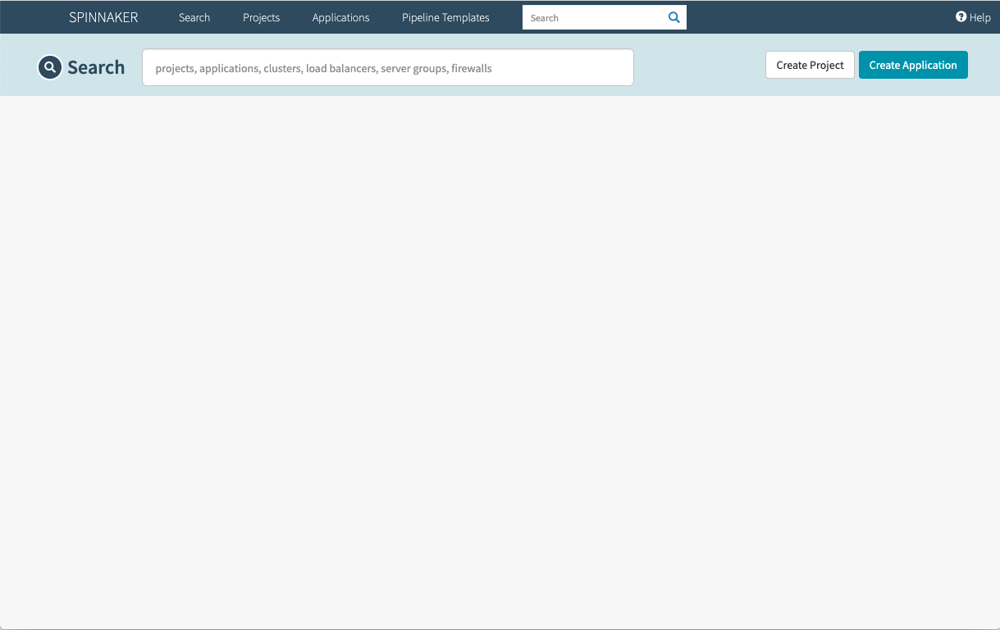

🎉 축하합니다, 여러 분은 스핀에커를 쿠버네티스 클러스터에 설치하였습니다.

## 애플리케이션 (마이크로서비스)
스핀에커에서는 하나의 마이크로서비스를 애플리케이션이라고 부릅니다. 스핀에커에 접속해서 보면 오른 쪽 위에 *Create Application* 단추가 있습니다. 눌러서 새 어플리케이션을 생성합니다. 어플리케이션 이름은 *yelb* 로 지정하고 이메일은 본인의 이메일을 입력합니다.

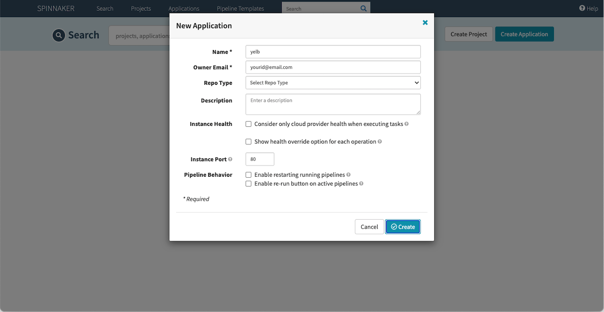

### 서비스 메시 파이프라인
애플리케이션을 빌드하고 배포하는 과정을 자동화하는 것을 파이프라인(Pipeline)이라고 부릅니다. 워크플로우(Workflow)라고 표현하기도 하지만 지속적 전달(Continuous Delivery)에서는 파이프라인 이라는 용어를 사용하고 있습니다. 이제 다음 단계로 이동해서 첫 번째 파이프라인을 만들겠습니다.

**yelb** 어플리케이션을 생성했다면, 이제 그 안에서 파이프라인을 만들어야 합니다. 화면에 나타난 *Create new pipeline* 을 눌러서 파이프라인 이름을 입력합니다. `service-mesh` 를 입력하고 확인을 누르면 파이프라인을 편집할 수 있는 화면이 나옵니다.

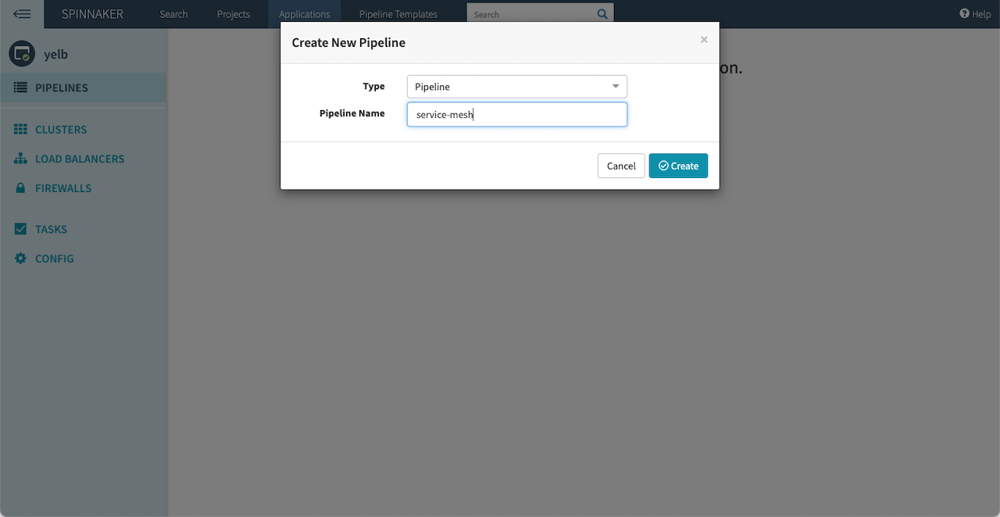

##### 빌드 스테이지
AWS CodeBuild를 이용하여 컨테이너 이미지를 빌드 합니다. 빌드에 성공하면 컨테이너 이미지는 ECR에 저장되며, 쿠버네티스(Kubernetes) 매니페스트 파일들은 S3 버켓에 저장됩니다. S3 버켓 이름은 테라폼에서 생성할 때 임의의 이름이 추가됩니다. S3 서비스에서 배켓을 조회하면 *artifact-xxxx-yyyy* 와 같은 형식의 이름을 가진 버켓을 볼 수 있습니다. 버켓 이름은 파이프라인 설정에 필요하므로 별도로 메모하시길 바랍니다.

*Add stage* 를 누르면 파이프라인에 추가할 작업을 선택할 수 있습니다. 여기서 *AWS CodeBuild*를 선택합니다. 그러면 아래에 빌드 작업에 필요한 정보를 입력하는 공간이 나타납니다.

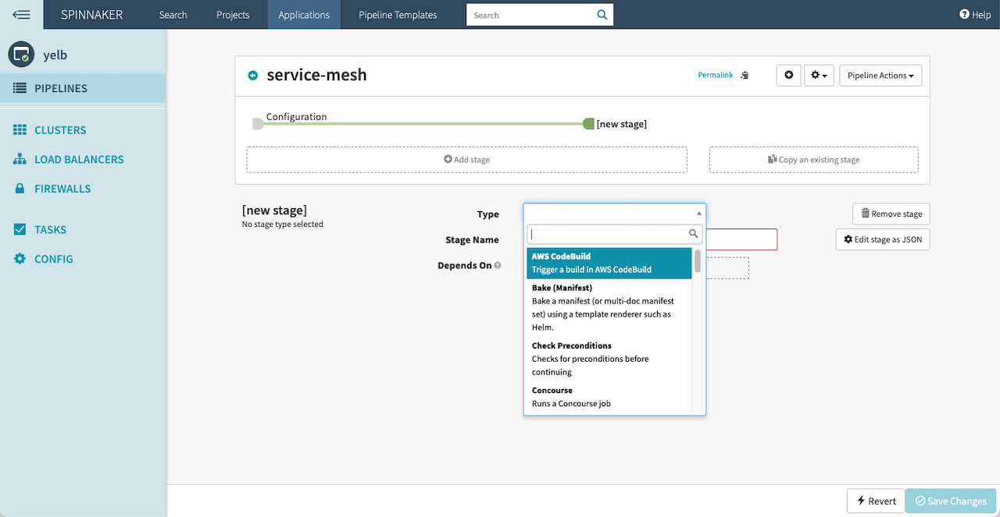

필요한 정보를 입력합니다. (프로젝트 이름의 뒷 10자리는 테라폼을 수행할 때 자동으로 지정되는 중복방지 일련번호이므로 상황에 따라 달라질 수 있습니다)

 - **Account:** platform
 - **Project Name:** yelb-hello-xxxxx-yyyyy

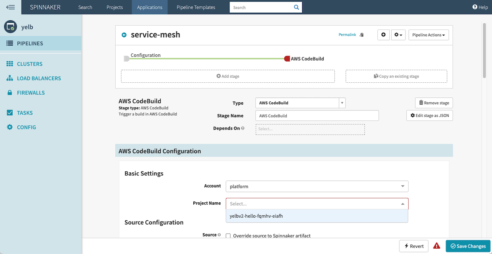

화면 맨 아래 *Save Changes*를 눌러서 저장합니다. 저장 후 변경사항이 반영 된 것을 확인합니다.

#### 기본 애플리케이션 배포 스테이지
기본 설정의 컨테이터 애플리케이션을 배포 합니다. 데이터베이스, 캐시, 애플리케이션 서버, UI 서버를 배포합니다. 또한 기본 애플리케이션에 서비스 메시(AWS App Mesh)를 적용합니다. *Add stage* 를 누른다음, 스테이지의 종류로 *Deploy (Manifest)* 를 선택합니다.


필요한 정보를 선택합니다. Account는 *eks* 를 선택하고 Namespace는 *Override Namespace* 를 눌러서 나오는 목록 중 *hello* 로 시작하는 것을 선택합니다. (네임스페이스 이름의 뒷 10자리는 테라폼을 수행할 때 자동으로 지정되는 pet name 이므로 상황에 따라 달라질 수 있습니다)

 - **Account:** eks
 - **Namespace:** hello-xxxxx-yyyyy

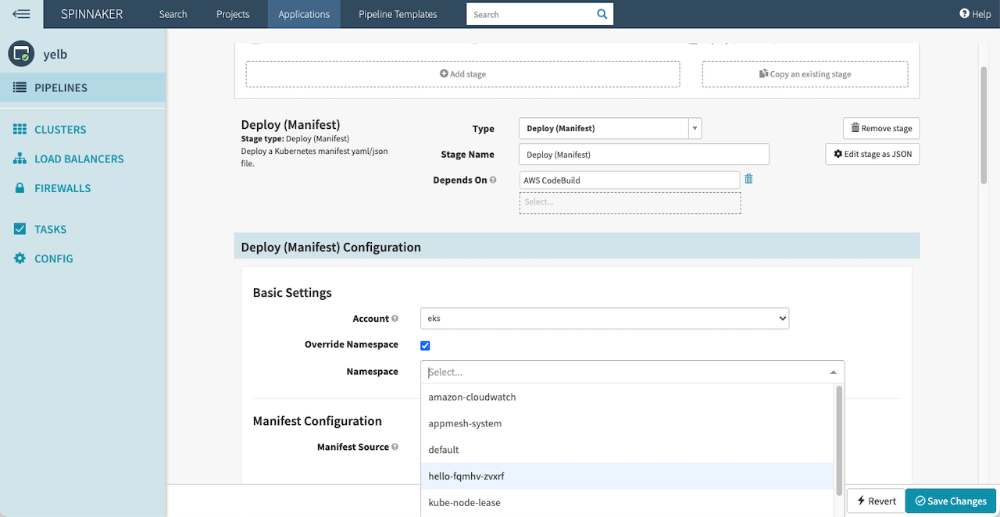

배포환경 설정을 이어서 진행합니다.

 + 매니페스트 소스를 아티팩트로 지정합니다.
   - **Manifest Source:** Artifact

 + 매니페스트 소스의 세부 설정을 지정합니다. *Manifest Artifact* 옆의 목록을 누르면 *Define a new artifact* 문구가 나타납니다. 눌러서 선택하면 여러 추가 정보들을 입력하는 화면이 나타납니다. 여기서 *Account* 를 아래와 같이 선택합니다. *Object Path* 부분에는 `1.app-v1.yaml`파일의 S3 경로를 입력하면 됩니다.
   - **Account:** platform
   - **Object Path:** s3://artifact-xxxx-yyyy/1.app-v1.yaml

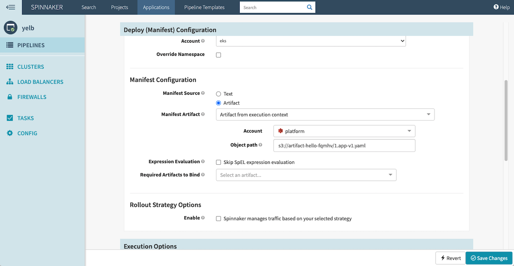

배포 후 다음 단계로 넘어가기 전에 잠시 대기하도록 파이프라인을 설계합니다. 사용자의 승인 절차를 추가하기 위하여 *Add stage* 를 누른 다음 *Manual Judgment* 를 선택합니다.

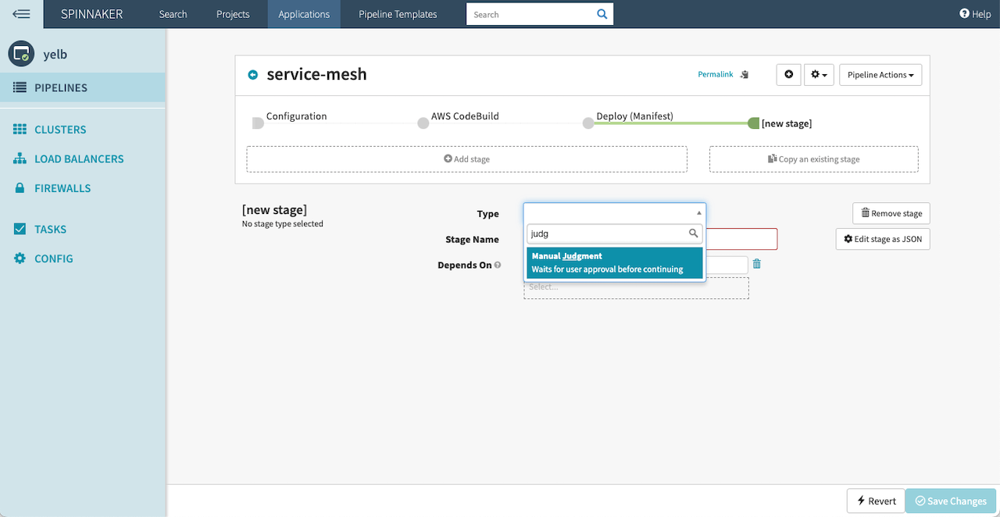

화면 맨 아래 *Save Changes*를 눌러서 저장합니다. 저장 후 변경사항이 반영 된 것을 확인합니다.

#### 신규 버전 배포 스테이지
이제 새 버전의 애플리케이션 서버를 배포합니다. AWS CodeBuild 파이프라인에서 생성한 새로운 컨테이너 이미지를 이용하여 배포할 것 입니다. *Add stage* 를 누른다음, 스테이지의 종류로 *Deploy (Manifest)* 를 선택합니다.
필요한 정보를 선택합니다. Account는 *eks* 를 선택하고 Namespace는 *Override Namespace* 를 눌러서 나오는 목록 중 *hello* 로 시작하는 것을 선택합니다.

 - **Account:** eks
 - **Namespace:** hello-xxxxx-yyyyy

배포환경 설정을 이어서 진행합니다.

 + 매니페스트 소스를 아티팩트로 지정합니다.
   - **Manifest Source:** Artifact

 + 매니페스트 소스의 세부 설정을 지정합니다. *Manifest Artifact* 옆의 목록을 누르면 *Define a new artifact* 문구가 나타납니다. 눌러서 선택하면 여러 정보들을 입력하는 화면이 나타납니다. 여기서 *Account* 를 아래와 같이 선택합니다. *Object Path* 부분에는 `2.app-v2.yaml`파일의 S3 경로를 입력하면 됩니다.
   - **Account:** platform
   - **Object Path:** s3://artifact-xxxx-yyyy/2.app-v2.yaml

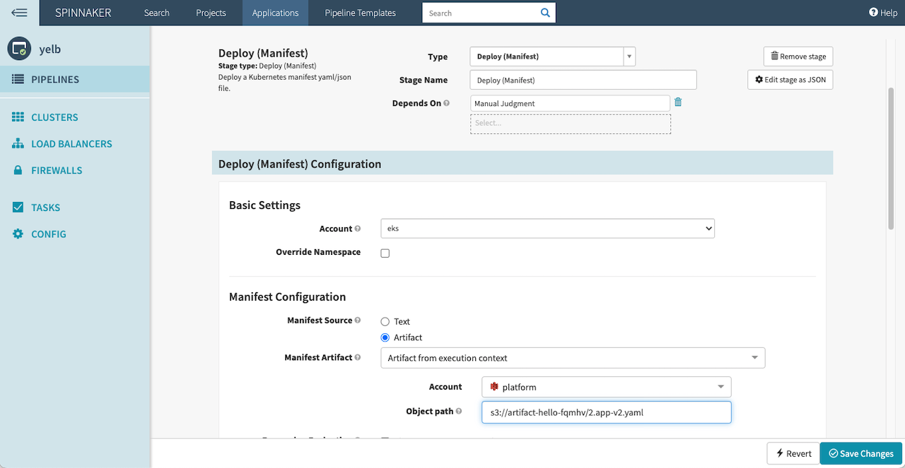

배포 후 다음 단계로 넘어가기 전에 잠시 대기하도록 파이프라인을 설계합니다. 사용자의 승인 절차를 추가하기 위하여 *Add stage* 를 누른 다음 *Manual Judgment* 를 선택합니다.

화면 맨 아래 *Save Changes*를 눌러서 저장합니다. 저장 후 변경사항이 반영 된 것을 확인합니다.

#### 가중치 기반 라우팅 스테이지
사용자 승인 절차를 추가했다면, 가중치 기반 라우팅 설정을 적용하는 스테이지를 추가합니다. *Add stage* 를 누른다음, 스테이지의 종류로 *Deploy (Manifest)* 를 선택합니다.

필요한 정보를 선택합니다. Account는 *eks* 를 선택하고 Namespace는 *Override Namespace* 를 눌러서 나오는 목록 중 *hello* 로 시작하는 것을 선택합니다.

 - **Account:** eks
 - **Namespace:** hello-xxxxx-yyyyy

배포환경 설정을 이어서 진행합니다.

 + 매니페스트 소스를 아티팩트로 지정합니다.
   - **Manifest Source:** Artifact

 + 매니페스트 소스의 세부 설정을 지정합니다. *Manifest Artifact* 옆의 목록을 누르면 *Define a new artifact* 문구가 나타납니다. 눌러서 선택하면 여러 정보들을 입력하는 화면이 나타납니다. 여기서 *Account* 를 아래와 같이 선택합니다. *Object Path* 부분에는 `3.weighted-route.yaml`파일의 S3 경로를 입력하면 됩니다.
   - **Account:** platform
   - **Object Path:** s3://artifact-xxxx-yyyy/3.weighted-route.yaml

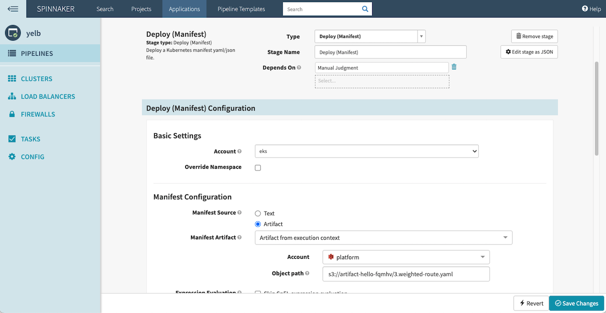

화면 맨 아래 *Save Changes*를 눌러서 저장합니다. 저장 후 변경사항이 반영 된 것을 확인합니다.

### 파이프라인 실행
파이프라인 빠져 나오기 화살표를 눌러서 파이프라인 편집 화면 밖으로 이동합니다. 화면 위 쪽, *service-mesh* 라고 되어 있는 파이프라인 이름 옆에 작은 화살표가 있습니다.

파이프라인 설정이 되었으면, *Start Manual Execution* 을 눌러서 파이프라인을 실행합니다. CodeBuild 프로젝트가 빌드를 시작하며 약 2분 정도 소요됩니다.

빌드가 성공했으면, AWS 콘솔로 들어가서 ECR 서비스 화면으로 이동합니다. 새로 생성한 컨테이터 이미지가 나타날 것입니다. 그리고 S3 서비스 화면으로 이동합니다. 버켓 목록 중 *artifact-xxxx-yyyy* 와 같은 형식의 이름을 가진 버켓이 있을 것입니다. 해당 버켓을 눌러서 안으로 들어갑니다. 빌드 결과물을 볼 수 있습니다.

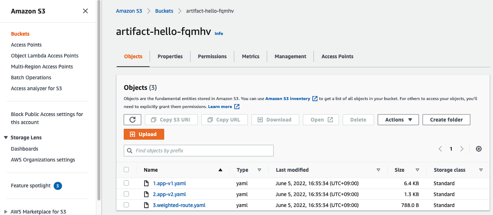

배포가 성공했으면, 스핀에커 왼 쪽의 메뉴에서 클러스터를 누릅니다. 컨테이너 정보들이 나타날 것입니다. 클러스터를 선택하면 애플리케이션 인스턴스를 볼 수 있습니다. 포드를 선택하고, 오른 쪽의 자세히 보기 화면에서 *Console Output* 을 누릅니다. 그러면 아래와 같이 포드 안의 컨테이너들의 로그를 볼 수 있습니다. ENVOY, XRAY_DAEMON이 함께 보인다면 제대로 반영된 것입니다.

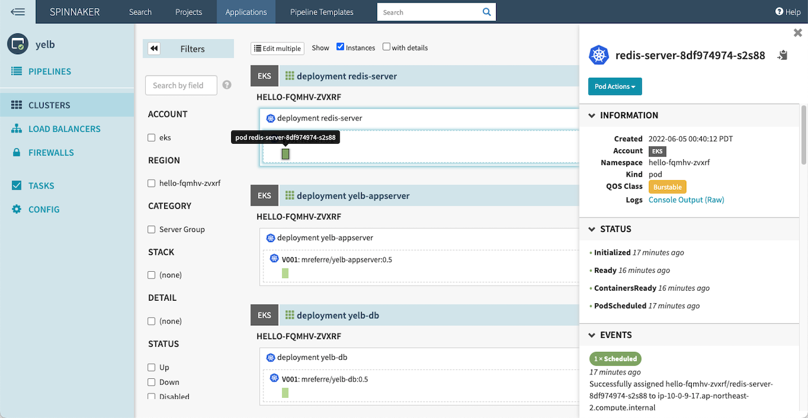
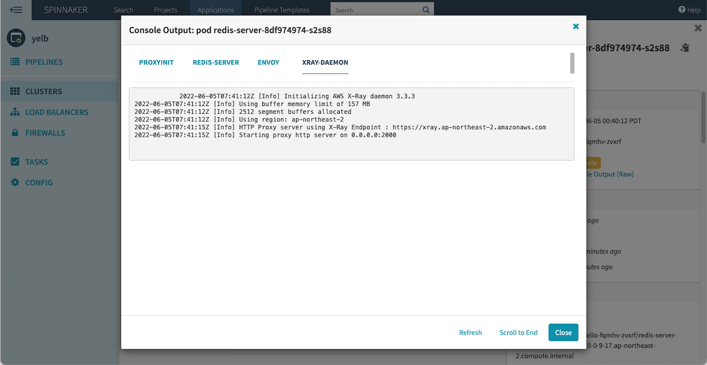

왼 쪽 메뉴의 로드 발란서를 누르면 쿠버네티스 인그레스와 서비스가 표시됩니다. 인그레스를 선택하면 화면 오른 쪽에 자세한 정보가 표시되며, 접속 도메인이 표시됩니다. 인그레스 도메인을 복사한 후 브라우저의 새 탭 또는 새 윈도우에서 붙여넣기 합니다. 애플리케이션이 동작하는 모습을 볼 수 있습니다.

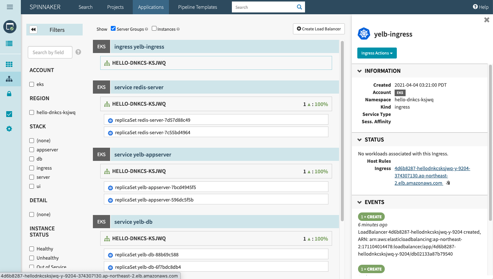

파이프라인은 기본 애플리케이션 배포까지만 수행하였고, 새로운 버전의 애플리케이션을 배포하는 다음 단계로 진행하기 전 승인단계에서 대기하고 있습니다. 파이프라인의 모습은 아래 그림과 같습니다. 계속 진행할 지, 실행을 멈출 지 입력을 기다리는 상태입니다. 기본 애플리케이션일 잘 동작하는 것을 확인했다면, 다음 단계로 진행합니다. *Continue* 를 누르면 새로운 버전의 애플리케이션 서버를 배포합니다.

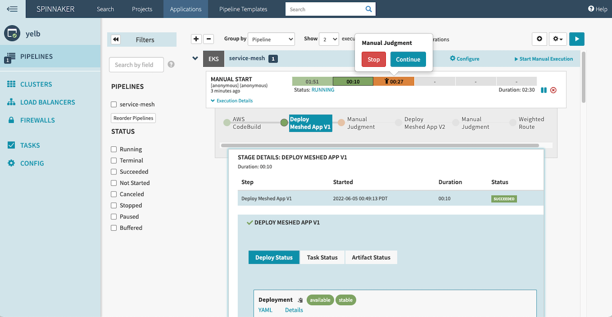

새로운 버전의 애플리케이션이 배포가 되었지만, ALB를 통해서 접속한 서비스는 '새로고침'을 반복해도 변화가 없습니다. 컨테이너만 배포를 했을 뿐, App Mesh에서 트래픽을 새 버전의 서버로 보내지 않고 있기 때문입니다. 이제 새 버전의 애플리케이션 서버에도 트래픽을 보내도록 설정합니다. 예제에서는 50:50으로 예전 서버와 새 버전의 서버로 트래픽을 보내도록 설정할 것입니다. 기본 애플리케이션 배포 파이스파인에서처럼 새 애플리케이션 배포가 끝난 직후 다음과 같이 사용자 입력을 기다리고 있을 것입니다. 가중치 기반 라우팅을 적용하기 위하여 *Continue* 를 선택합니다. 일시 정지 하였던 파이프라인이 다시 실행되면서 가중치 기반 트래픽 라우팅 설정을 반영할 것입니다.

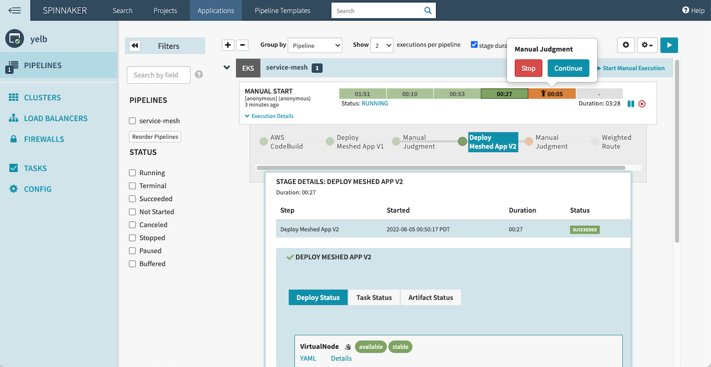

ALB를 통해서 접속한 서비스에서 '새로고침'을 반복하면 화면 하단의 애플리케이션 서버 버전 표시가 변경되는 것을 볼 수 있습니다.

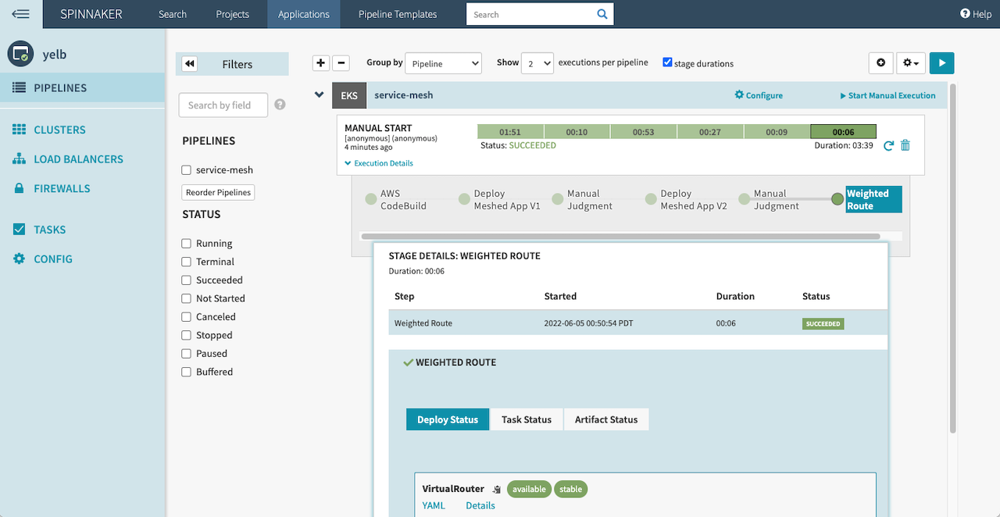

## 관찰
서비스 배포가 잘 되었는 지, 서비스가 잘 동작하는 지 확인하기 위하여 모니터링이 필요합니다. 이번 실습에서는 Amazon CloudWatch Container Insights(Metrics, Logs)와 AWS X-Ray(Trace)가 적용되어 있습니다. CloudWatch 서비스 화면으로 이동합니다. 내비게이션 메뉴에서 *컨테이너 인사이츠(Container Insights)* 와 *서비스 렌즈(Service Lens)* 를 선택하면 다음과 같이 모니터링 할 수 있습니다.

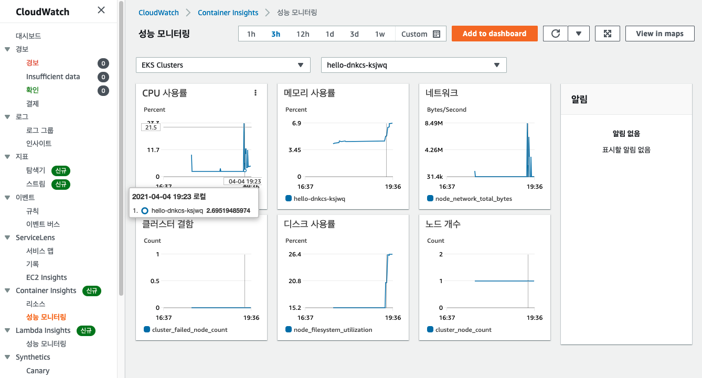
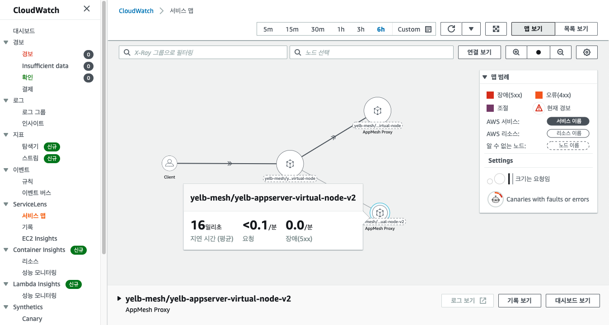
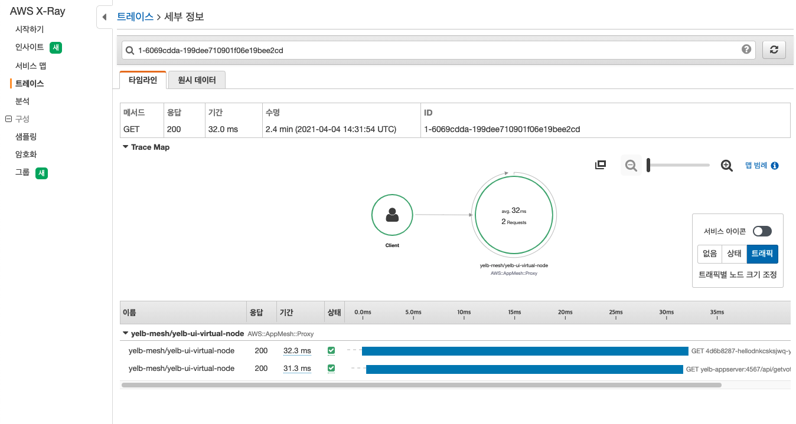

## 카오스 엔지니어링 (Chaos Engineering)
카오스 엔지니어링은 계획되지 않은 중단을 견딜 수 있는지 확인하기 위해 분산 컴퓨팅 시스템을 테스트하는 프로세스입니다. 카오스 엔지니어링의 목표는 무작위적이고 예측할 수 없는 행동을 도입하는 통제된 실험을 통해 시스템의 약점을 식별하고 수정하는 것입니다. 따라서 카오스 엔지니어링은 목적 없이 무작위로 대상을 파괴하는 것이 아니라 통제된 환경에서 잘 계획된 실험을 통해 응용 프로그램이 혼란스러운 조건을 견딜 수 있도록 애플리케이션에 대한 신뢰를 구축하는 것입니다. 보다 자세한 내용은 [문서](https://github.com/Young-ook/terraform-aws-fis)를 참고하시기 바랍니다.

#### 안정 상태 정의
장애 주입 실험을 시작하기 전에 사용자 경험에 이상이 없는 지, 시스템이 정상동작하는 지, 모니터링 수치는 잘 나오고 있는 지 확인할 필요가 있습니다. 그래서 서비스에 문제가 없다고 판단할 기준을 정의해야 합니다. 우리는 이 것을 '안정 상태'라고 부를 것입니다. 이 번 실습에서는 UI 프론트엔드를 담당하는 컨테이너가 한 개 이상 존재하고 노드의 CPU 사용율이 60% 이하일 경우 안정 상태라고 판단할 것입니다.

애플리케이션의 기능 점검을 위해 다음과 같은 것들을 시도해 볼 것입니다:
1. 좋아하는 음식점에 투표합니다.
1. 화면 아래 새로 고침 횟수에 표시 되는 값이 바뀌는 지 확인하기 위하여 브라우저를 여러 번 새로고침 합니다.
1. 클라우드와치(CloudWatch) 알람들이 OK인 지 확인합니다.

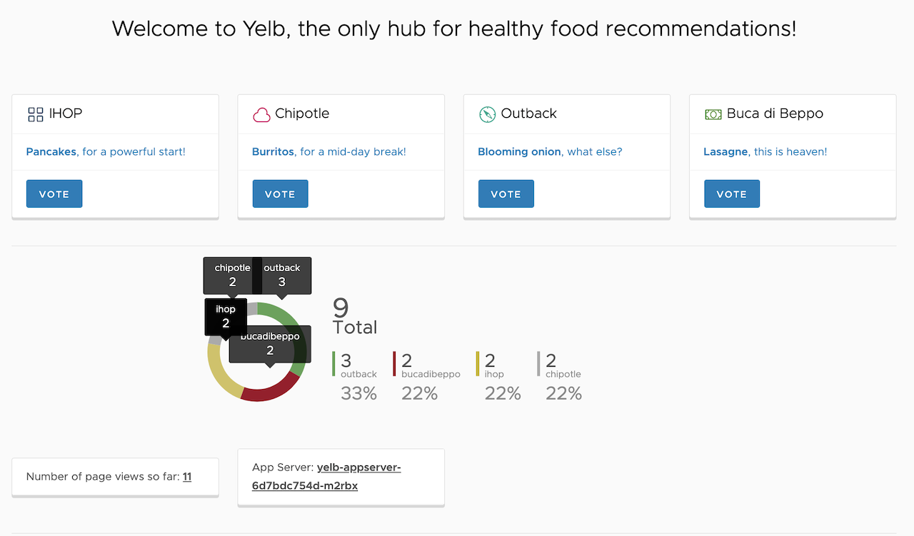
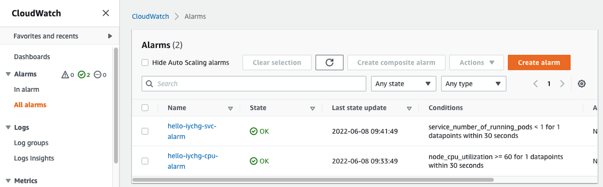

#### 가설 수립
이 실험에서 우리는 컴퓨팅 노드가 갑자기 종료되었을 경우, 애플리케이션이 가용성 확보를 위한 설정이 잘 되었는 지 확인해 볼 것입니다. 애플리케이션은 쿠버네티스 클러스터에 배포 되었기 때문에, 만약 몇몇 노드가 종료된다고 하더라도 쿠버네티스 스케쥴러에서 다른 정상 노드에 포드(Pod)를 재배포 할 것이라고 가정하였습니다. 카오스 엔지니어링이 과학적 방법을 따르기 위하여 가설을 세우는 것부터 시작할 필요가 있습니다. 아래와 같은 실험 차트를 활용하여 실험 설계를 할 수 있습니다. 5분 정도의 시간을 내어 여러분의 실험 계획을 세우시길 바랍니다.

**안정 상태 가설 예제**

+ 제목: 모든 서비스에 접근할 수 있고 잘 동작합니다.
+ 종류: 여러 분이 가정한 것은 무엇입니까?
   - [ ] 영향 없음
   - [ ] 성능 저하
   - [ ] 서비스 단절
   - [ ] 성능 향상
+ 측정:
   - 종류: CloudWatch Metric
   - 상태: `service_number_of_running_pods` 값이 0보다 큼
+ 실험 중단 조건 (실험 취소 조건):
   - 종류: CloudWatch Alarm
   - 상태: `service_number_of_running_pods` 값이 1보다 적음
+ 결과:
   - 어떤 현상을 확인했습니까?
+ 결론:
   - [ ] 모든 것이 예상한 것과 같음
   - [ ] 이상 현상 감지
   - [ ] 대응 가능한 오류 발생
   - [ ] 자동화 필요
   - [ ] 정밀 분석 필요

#### 실험
EKS 노드 그룹의 모든 인스턴스가 잘 동작하고 있는 지 확인합니다. AWS 콘설에서 AWS FIS 서비스 페이지로 이동합니다. 그리고 실험 템플릿 목록 중에서 `TerminateEKSNodes` 을 선택합니다. 다음, `Actions` 단추를 눌러서 실험을 시작합니다. AWS FIS는 현재 실행 중인 EKS 노드의 최대 70%까지 종료시킬 수 있는데, 그 이유는 운영환경에서 모든 노드를 한 번에 종료시키는 것은 위험 동작이기 때문입니다. 이 실험에서는 동작중인 노드 중에서 40%의 노드를 종료 시킵니다. 만약 종료시킬 노드의 수를 변경하고 싶다면, 실험 템플릿을 편집하면됩니다. 노드가 종료 중인 상황을 확인하려면 EC2 서비스 페이지로 이동합니다. 인스턴스 목록 중에서 일부 인스턴스가 종료 되는 것을 볼 수 있습니다.

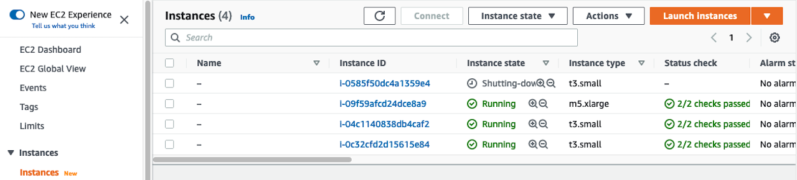

스핀에커에서 포드가 (갑자기) 종료되는 것을 볼 수 있습니다. 아래 그림은 yelb-appserver 포드가 종료되는 상황을 보여줍니다. 어떤 포드가 종료될 지는 상황에 따라 다릅니다.

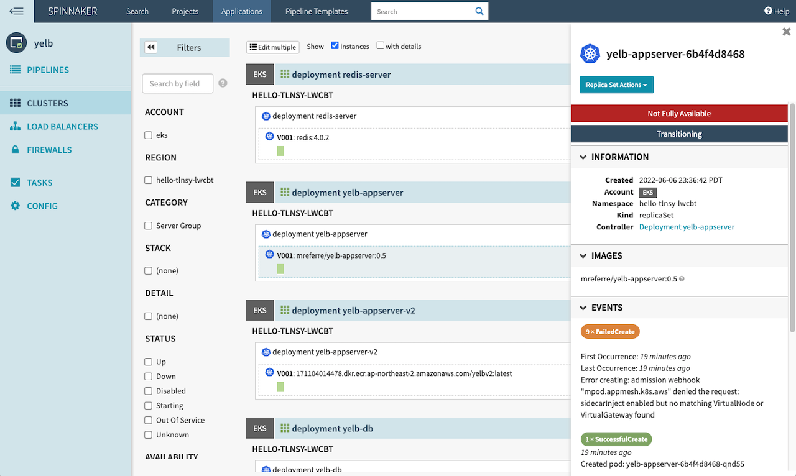

애플리케이션을 다시 접속해 보면, 제대로 동작하지 않는 것을 볼 수 있습니다. 아마도 일부 포드가 종료되면서 부분적으로 손상되었기 때문일 것입니다.

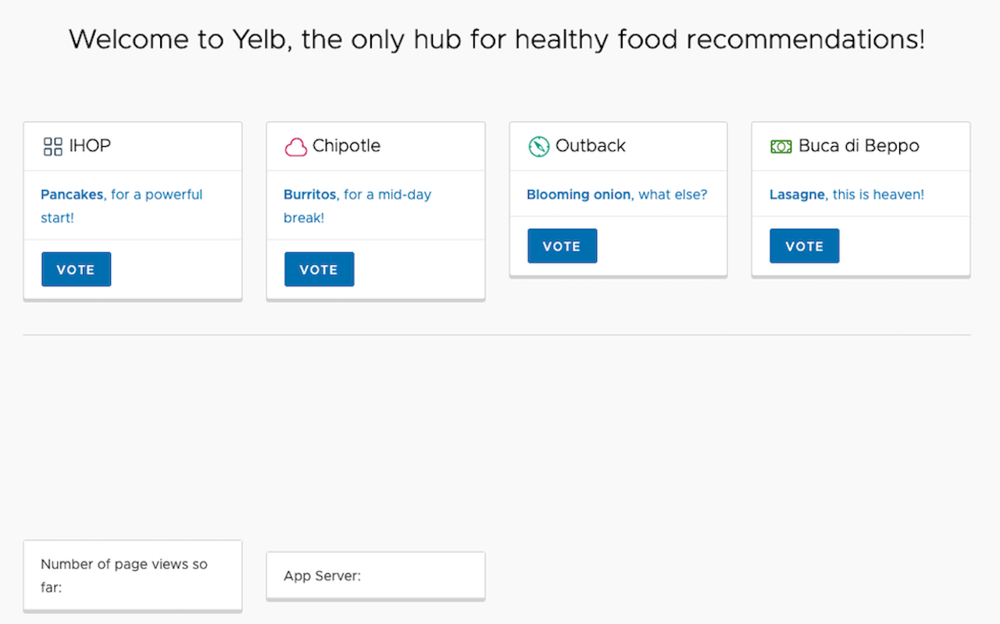

#### 토의
마이크로서비스 애플리케이션에 다시 접속해 봅시다. 어떤가요? 아마도 장애 주입 실험을 통하여 노드가 종료 되었을 것이고, 그래서 애플리케이션은 망가졌을 것입니다. 이 것은 처음에 배포한 애플리케이션의 아키텍처가 고가용성 특성(stateless, immutable, replicable)을 고려하지 않았기 때문입니다. 특정 노드, 특정 가용영역에서 문제 발생 시 대응하기 위한 준비가 없었습니다. 다음 단계를 통하여, 실험에서 발견된 내용을 바탕으로 어떻게 아키텍처 개선을 할 지 살펴 보겠습니다.

한 가지 더 살펴볼 것이 있습니다. 이 번 실험에서는, 서비스가 잘 동작하는 상태 (안정 상태)를 CPU 활용비용과 실행 중인 포드의 개수를 가지고 정의하였습니다. 그러나 첫 번째 실험 후, 여러 분은 모니터링 지표가 정상 범위에 있었음에도 애플리케이션이 제대로 동작하지 않는 상황을 보았습니다. 이러한 결과는 모니터링 간격 등의 이유로 인해서 상황을 인지하지 못한 경우에도, 장애가 일어날 수 있다는 것을 보여 줍니다. 실험을 통해서 알게 된 결과는 이상해 보일 수 있지만, 충분히 의미가 있습니다. 카오스 엔지니어링을 통하여 모니터링 지표와 서비스 품질 사이의 괴리를 직접 확인할 수 있었기 때문입니다. 카오스 엔지니어링을 통하여 가설을 검증하는 과정에서 의도한 결과를 얻는 것도 의미가 있으며, 의도하지 않게 알게 된 것도 의미가 있습니다. 다음 번 실험을 설계할 때 고려할 요소로 추가할 수 있기 때문입니다.

다음 단계로 이동합니다.

#### 아키텍처 개선
클러스터 오토스케일러(Cluster Autoscaler)는 아래 조건에 해당하는 경우 쿠버네티스 클러스터의 크기를 자동으로 조정하는 도구 입니다:
+ 클러스터의 자원이 부족하여 포드(Pod) 배치에 실패하는 경우
+ 특정 시간동안 사용량이 적은 클러스터 자원이 있을 때, 그 위에서 동작하는 포드가 다른 곳으로 옮겨서 실행해도 괜찮은 경우

클러스터 오토스케일러는 EC2 오토스케일링 그룹과 연동하여 동작합니다. 클러스터 오토스케일러는 런치 컨피규레이션(Launch Configuration) 또는 런치 템플릿(Launch Template)에 정의된 인스턴스 타입을 기준으로 EC2 오토스케일링 그룹의 CPU, 메모리, GPU 자원을 확인합니다. 보다 자세한 내용이 궁금하다면 [문서](https://github.com/kubernetes/autoscaler/tree/master/cluster-autoscaler/cloudprovider/aws)의 내용을 참고하시기 바랍니다.

클러스터 오토스케일러는 이미 설치 되어 있습니다. 클러스터 오토스케일러를 설치하는 코드는 [foundation/main.tf](foundation/main.tf) 파일의 맨 아래 부분에서 확인할 수 있습니다.

이제 포드(Pod)의 고가용성을 위한 pod-anti-affinity 설정을 추가하겠습니다.

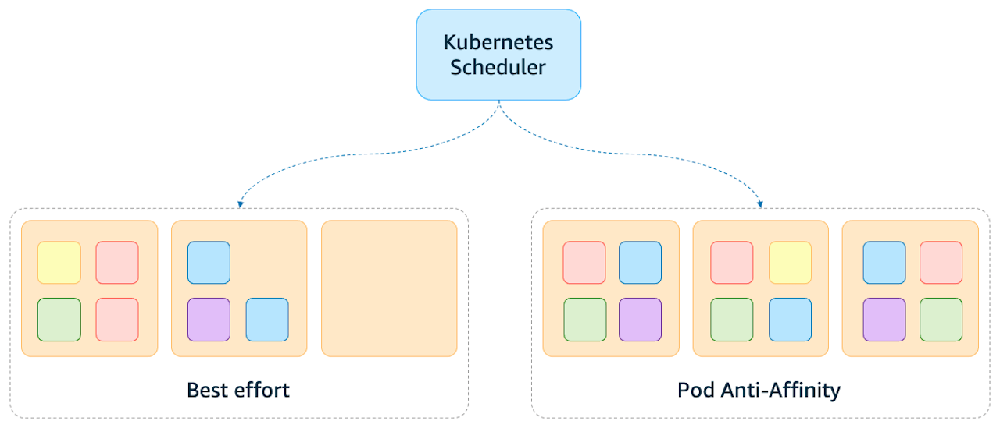

스핀에커 화면으로 돌아간 다음 **yelb** 애플리케이션 화면으로 이동합니다. 그리고 `chaos-engineering`이라는 이름으로 파이프라인을 새로 만듭니다. *Create* 단추를 누르면 파이프라인 생성 창이 나타납니다. 파이프라인 편집 화면으로 이동한 다음, *Add stage* 를 누릅니다. 그리고, 스테이지의 종류로 *Deploy (Manifest)* 를 선택합니다.

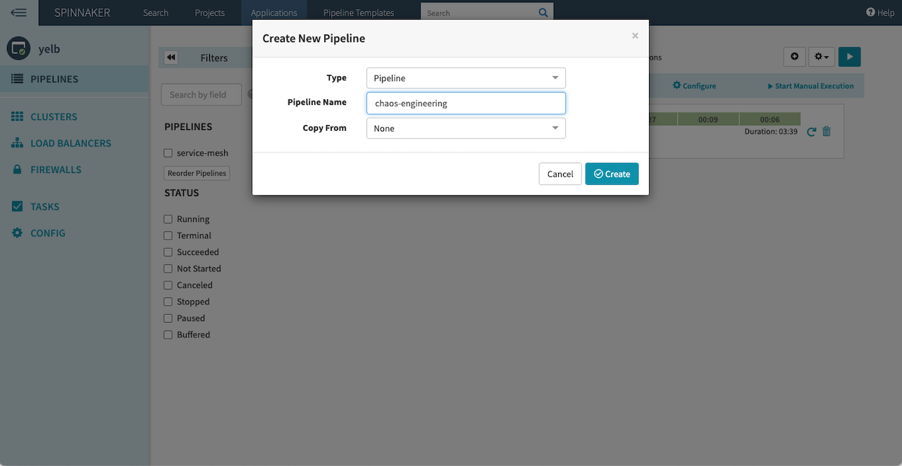

필요한 정보를 선택합니다. Account는 *eks* 를 선택하고 Namespace는 *Override Namespace* 를 눌러서 나오는 목록 중 *hello* 로 시작하는 것을 선택합니다.

 - **Account:** eks
 - **Namespace:** hello-xxxxx-yyyyy

배포환경 설정을 이어서 진행합니다.

 + 매니페스트 소스를 아티팩트로 지정합니다.
   - **Manifest Source:** Artifact

 + 매니페스트 소스의 세부 설정을 지정합니다. *Manifest Artifact* 옆의 목록을 누르면 *Define a new artifact* 문구가 나타납니다. 눌러서 선택하면 여러 정보들을 입력하는 화면이 나타납니다. 여기서 *Account* 를 아래와 같이 선택합니다. *Object Path* 부분에는 `4.high-availability.yaml`파일의 S3 경로를 입력하면 됩니다.
   - **Account:** Platform
   - **object path:** s3://artifact-xxxx-yyyy/4.high-availability.yaml

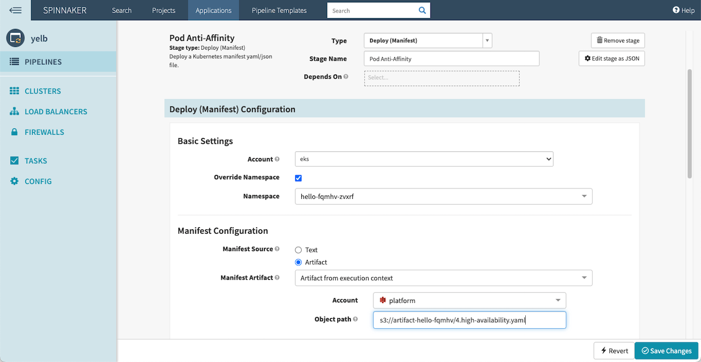

화면 맨 아래 *Save Changes*를 눌러서 저장합니다. 저장 후 변경사항이 반영 된 것을 확인합니다.

#### 반복 실험
파이프라인 편집을 완료하고 저장한 것까지 확인하였다면, *End Pipeline* 화살표를 눌러서 파이프라인 목록 화면으로 이동합니다. 화면 상단의 *chaos-engineering* 파이프라인 이름 왼 쪽에 보면 작은 화살표가 있습니다. 다음, *Start Manual Execution* 단추를 눌러서 파이프라인을 실행합니다.

AWS FIS 서비스 페이지로 돌아가서, EKS 노드 종료 실험을 다시 실행합니다. 실험을 반복적으로 실행했을 때, 마이크로서비스 애플리케이션이 사전에 정의한 안정 상태를 유지하는 지 살펴봅니다.

## 정리
여전히 Port Forward 로그가 찍히고 있을 것입니다. *ctrl + c* 를 눌러서 Port Forward 프로세스를 종료합니다. 다음, 인프라스트럭처 삭제 사전 작업으로 어플리케이션에서 생성한 자원을 삭제합니다. 다음과 같이 스크립트를 수행합니다. 쿠버네티스 네임스페이스를 삭제하는 시간이 오래 걸리니 스크립트가 종료될 때까지 중단하지 않도록 합니다.
```sh
./preuninstall.sh
terraform destroy --auto-approve
```

인프라스트럭처 삭제가 완료되면, 테라폼 백엔드를 정리합니다.
```sh
rm backend.tf
cd backend
terraform destroy --auto-approve
```

삭제가 완료되면, AWS 콘솔로 가서 CloudWatch 서비스로 이동합니다. 로그 그룹(Log groups)를 선택하고 검색 창에서 `hello` 를 입력합니다. 그림과 같이 `/aws/codebuild`, `/aws/containerinsights/`로 시작하는 로그 그룹을 선택한 다음 삭제 합니다.

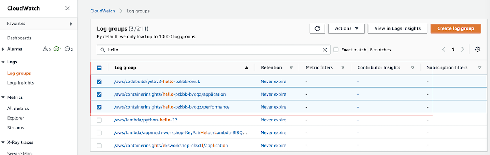

## 추가 자료
- [Terraform module: Amazon EKS (Elastic Kubernetes Service)](https://registry.terraform.io/modules/Young-ook/eks/aws/latest)
- [Terraform module: Amazon VPC (Virtual Private Cloud)](https://registry.terraform.io/modules/Young-ook/vpc/aws/latest)
- [Terraform module: AWS FIS (Fault Injection Simulator)](https://registry.terraform.io/modules/Young-ook/fis/aws/latest)
- [Terraform module: AWS IAM (Identity Access Management)](https://registry.terraform.io/modules/Young-ook/passport/aws/latest)
- [Terraform module: Terraform Backend](https://registry.terraform.io/modules/Young-ook/tfstate-backend/aws/latest)
