[[English](README.md)] [[한국어](README.ko.md)]
# 스핀에커와 함께하는 애플리케이션 현대화

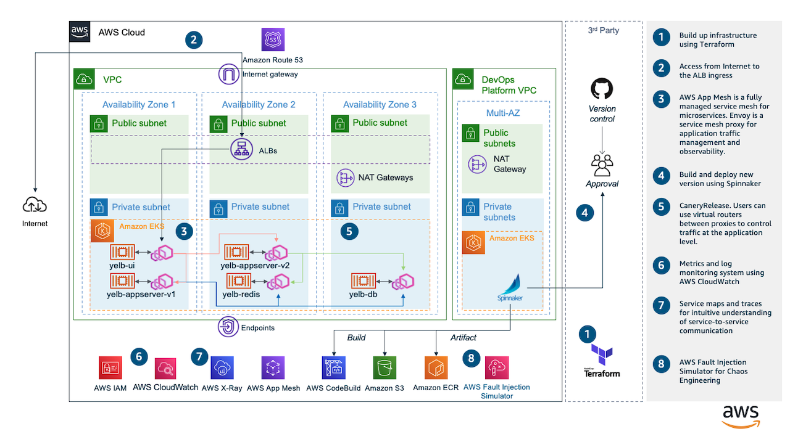

## 사전 준비
실습 예제에서는 테라폼([Terraform](https://terraform.io))과 쿠버네티스([Kubernetes](https://kubernetes.io/))를 사용합니다. 테라폼 CLI 가 없다면 메인 [페이지](https://github.com/Young-ook/terraform-aws-spinnaker#terraform)로가서 안내에 따라 설치합니다. 쿠버네티스 CLI가 없다면 공식 [페이지](https://kubernetes.io/docs/tasks/tools/#kubectl)의 안내에 따라 설치합니다.

## 생성
이 예제는 하시코프(HashCorp)와 스핀에커(Spinnaker)를 활용한 현대 애플리케이션을 구축하는 방법을 보여줍니다. [main.tf](main.tf)은 쿠버네티스(Kubernetes) 클러스터와 인프라스트럭처, 스핀에커를 여러 분의 AWS 계정에 생성하는 테라폼(Terraform) 설정 파일입니다.

다음과 같이 테라폼 명령을 실행합니다:
```
terraform init
terraform apply -target module.foundation
```

별도의 VPC에 데브옵스(DevOps) 플랫폼을 구축하기 위해서 추가로 다음의 명령을 실행합니다:
```
terraform apply -target module.platform
```

## 스핀에커 접속
할야드(Halyard)는 스핀에커 배포 생애주기를 관리하기 위한 명령줄 도구 입니다. 할야드를 활용하여 스핀에거의 각 마이크로서비스를 배포하고 관리할 수 있으며, 환경설정 파일을 중앙 관리할 수 있습니다. 스핀에커는 할야드를 통하여 설치하고, 관리하고 업그레이드 할 수 있습니다. 스핀에커 설치를 위하여 다음 명령을 실행합니다:
```
./halconfig.sh
```

설치가 완료되면, 쿠버네티스 프록시를 통하여 포트 포워딩하도록 다음 스크립트를 실행합니다:
```
./tunnel.sh
```
웹 브라우저를 열고 `http://localhost:8080`를 입력해서 스핀에커에 접속합니다. 만약, Cloud9에서 작업하고 있다면, *Preview*를 누르고, *Preview Running Application*를 누릅니다. 이 메뉴는 미리보기 탭을 생성하고 스핀에커를 띄워줍니다. 스핀에커에 처음 접속하면 다음과 같은 화면을 보게 될 것입니다.

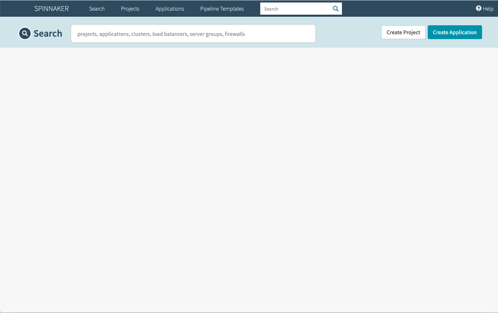

🎉 축하합니다, 여러 분은 스핀에커를 쿠버네티스 클러스터에 설치하였습니다.

## 애플리케이션 (마이크로서비스)
스핀에커에서는 하나의 마이크로서비스를 애플리케이션이라고 부릅니다. 스핀에커에 접속해서 보면 오른 쪽 위에 *Create Application* 단추가 있습니다. 눌러서 새 어플리케이션을 생성합니다. 어플리케이션 이름은 *yelb* 로 지정하고 이메일은 본인의 이메일을 입력합니다.

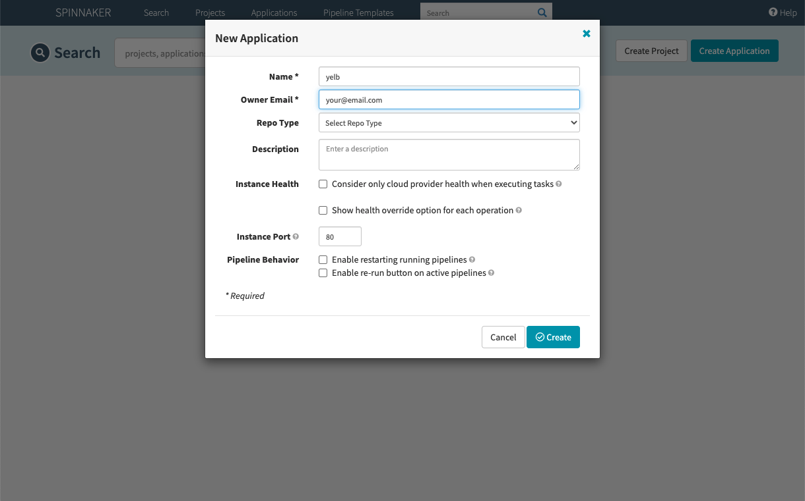

### 파이프라인
야플리케이션을 빌드하고 배포하는 과정을 자동화하는 것을 파이프라인(Pipeline)이라고 부릅니다. 워크플로우(Workflow)라고 표현하기도 하지만 지속적 전달(Continuous Delivery)에서는 파이프라인 이라는 용어를 사용하고 있습니다. 이제 다음 단계로 이동해서 첫 번째 파이프라인을 만들겠습니다.

#### 빌드
AWS CodeBuild를 이용하여 컨테이너 이미지를 빌드 합니다. 빌드에 성공하면 컨테이너 이미지는 ECR에 저장되며, 쿠버네티스(Kubernetes) 매니페스트 파일들은 S3 버켓에 저장됩니다. S3 버켓 이름은 테라폼에서 생성할 때 임의의 이름이 추가됩니다. S3 서비스에서 배켓을 조회하면 artifact-xxxx-yyyy 와 같은 형식의 이름을 가진 버켓을 볼 수 있습니다.

**yelb** 어플리케이션을 생성했다면, 이제 그 안에서 파이프라인을 만들어야 합니다. 화면에 나타난 *Create new pipeline* 을 눌러서 파이프라인 이름을 입력합니다. *build* 를 입력하고 확인을 누르면 파이프라인을 편집할 수 있는 화면이 나옵니다.

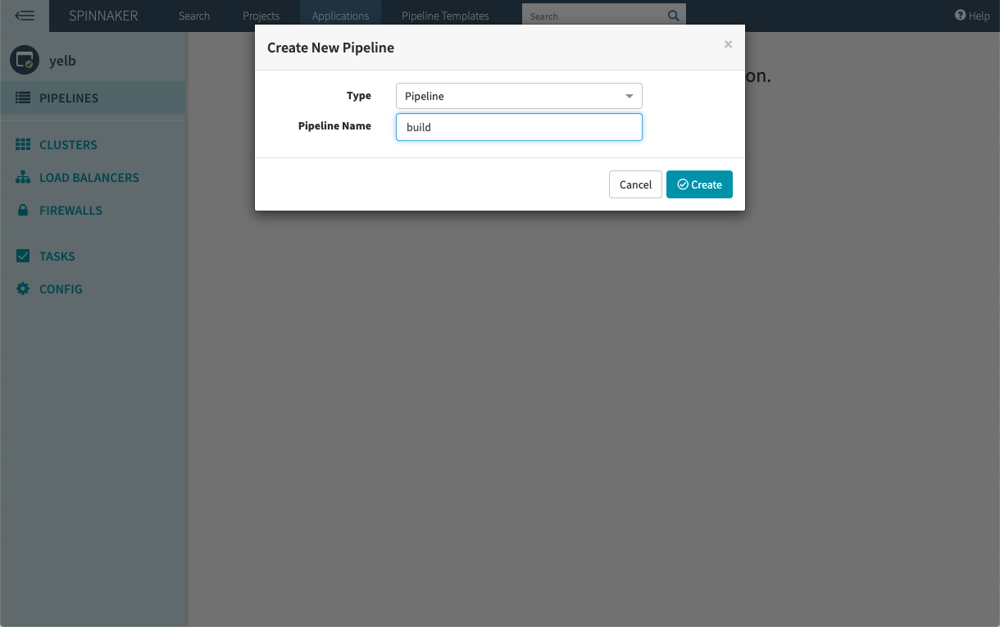

다음, *Add stage* 를 누르면 파이프라인에 추가할 작업을 선택할 수 있습니다. 여기서 *AWS CodeBuild*를 선택합니다. 그러면 아래에 빌드 작업에 필요한 정보를 입력하는 공간이 나타납니다.

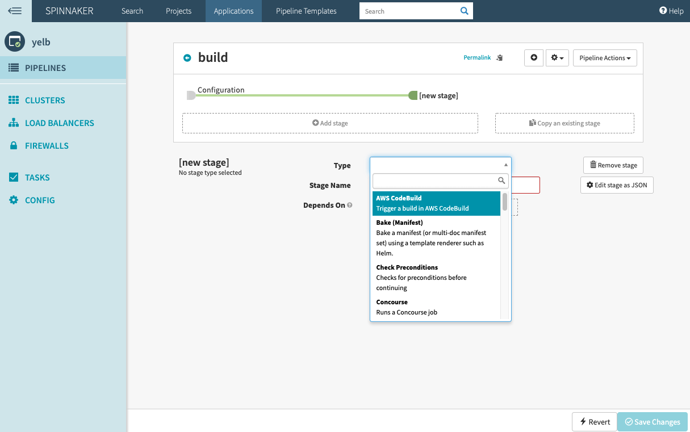

필요한 정보를 입력합니다. (프로젝트 이름의 뒷 10자리는 테라폼을 수행할 때 자동으로 지정되는 중복방지 일련번호이므로 상황에 따라 달라질 수 있습니다)

 - **Account:** platform
 - **Project Name:** yelb-hello-xxxxx-yyyyy

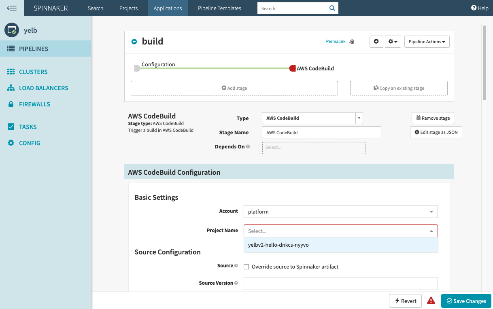

화면 맨 아래 *Save Changes*를 눌러서 저장합니다.
저장 후 변경사항이 반영 된 것을 확인했으면, 파이프라인 빠져 나오기 화살표를 눌러서 파이프라인 편집 화면 밖으로 이동합니다. 화면 위 쪽, *build*라고 되어 있는 파이프라인 이름 옆에 작은 화살표가 있습니다.

파이프라인 설정이 되었으면, *Start Manual Execution* 을 눌러서 파이프라인을 실행합니다. CodeBuild 프로젝트가 빌드를 시작하며 약 2분 정도 소요됩니다.

빌드가 성공했으면, AWS 콘솔로 들어가서 ECR 서비스 화면으로 이동합니다. 새로 생성한 컨테이터 이미지가 나타날 것입니다. 그리고 S3 서비스 화면으로 이동합니다. 버켓 목록 중 *artifact-xxxx-yyyy* 와 같은 형식의 이름을 가진 버켓이 있을 것입니다. 해당 버켓을 눌러서 안으로 들어갑니다.

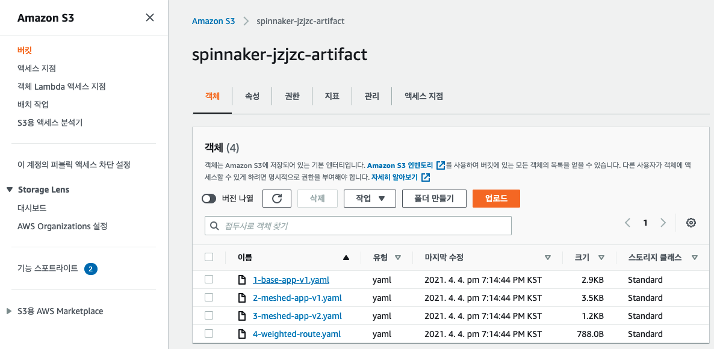

#### 베이스 애플리케이션
기본 설정의 컨테이터 애플리케이션을 배포 합니다. 데이터베이스, 캐시, 애플리케이션 서버, UI 서버를 배포합니다. 먼저, 새 파이프라인을 생성합니다. 화면 오른 쪽 윗 부분에 파이프라인 생성 단추가 있습니다. 파이프라인 이름으로 `base-app-v1` 입력하고 확인을 누릅니다. *Add stage* 를 눌러서 스테이지의 종류를 선택합니다. 이 번에는 배포를 할 것이므로 *Deploy (Manifest)* 를 선택합니다.

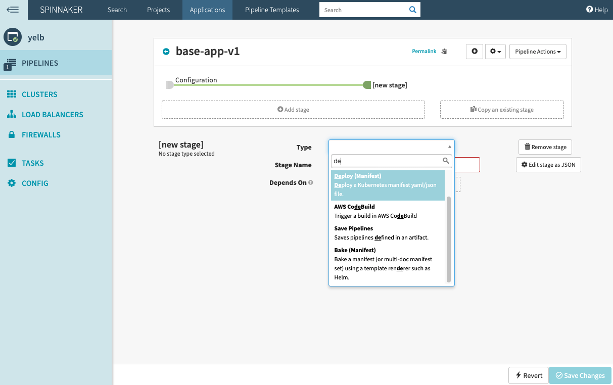

필요한 정보를 선택합니다. Account는 *eks* 를 선택하고 Namespace는 *Override Namespace* 를 눌러서 나오는 목록 중 *hello* 로 시작하는 것을 선택합니다. (네임스페이스 이름의 뒷 10자리는 테라폼을 수행할 때 자동으로 지정되는 pet name 이므로 상황에 따라 달라질 수 있습니다)

 - **Account:** eks
 - **Namespace:** hello-xxxxx-yyyyy

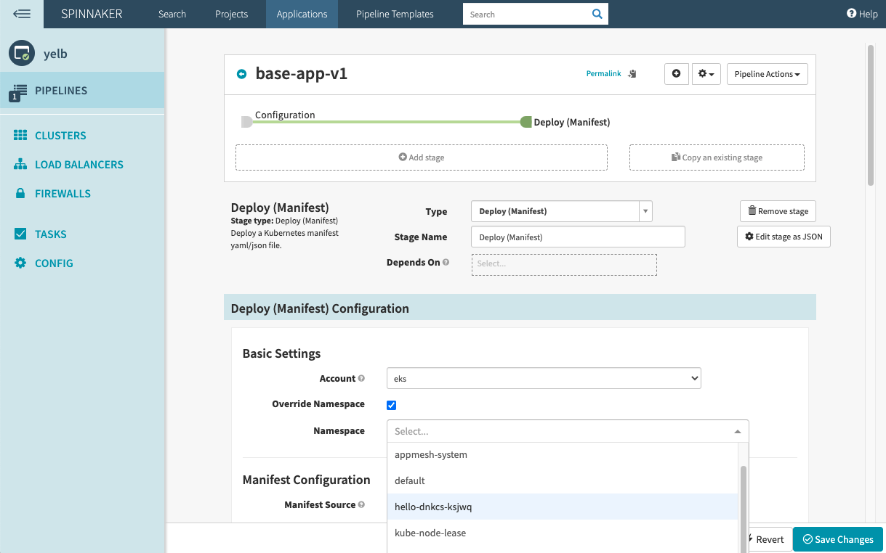

배포할 애플리케이션 설정 파일을 지정하기 위해서 S3 화면으로 이동합니다. *artifact-xxxx-yyyy* 버켓으로 이동해서 *1-base-app-v1.yaml* 을 선택합니다. 객체에 대한 자세한 정보를 표시하는 화면으로 이동했다면, S3 객체 URI 앞에 있는 작은 사각형이 두 개 겹쳐있는 모양을 누릅니다. *S3 URI 복사됨* 팝업을 확인했으면, 다시 스핀에커 파이프라인 편집 화면으로 돌아갑니다.

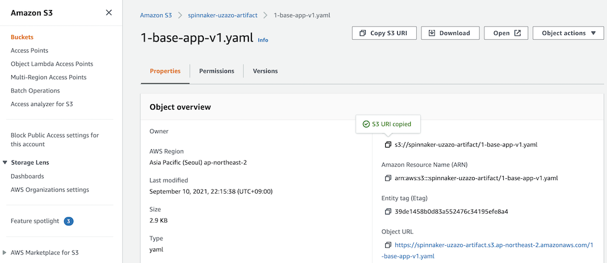

배포환경 설정을 이어서 진행합니다.

 + 매니페스트 소스를 아티팩트로 지정합니다.
   - **Manifest Source:** Artifact

 + 매니페스트 소스의 세부 설정을 지정합니다. *Manifest Artifact* 옆의 목록을 누르면 *Define a new artifact* 문구가 나타납니다. 눌러서 선택하면 여러 추가 정보들을 입력하는 화면이 나타납니다. 여기서 *Account* 를 아래와 같이 선택합니다. Object Path 부분에는 앞에서 복사한 S3 URI를 붙여넣으면 됩니다.
   - **Account:** platform
   - **Object Path:** s3://artifact-xxxx-yyyy/1-base-app-v1.yaml

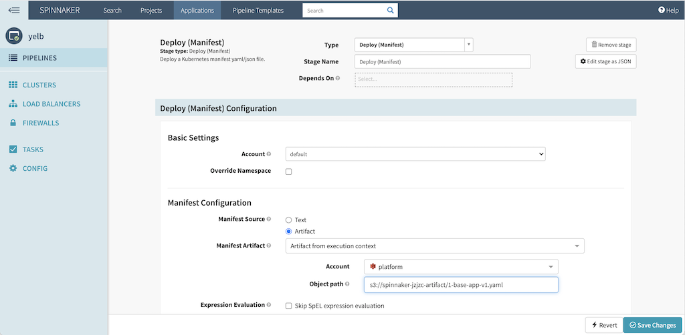

화면 맨 아래 *Save Changes*를 눌러서 저장합니다.
저장 후 변경사항이 반영 된 것을 확인했으면, 파이프라인 빠져 나오기 화살표를 눌러서 파이프라인 편집 화면 밖으로 이동합니다. 화면 위 쪽, *build*라고 되어 있는 파이프라인 이름 옆에 작은 화살표가 있습니다.

파이프라인 설정이 되었으면, *Start Manual Execution* 을 눌러서 파이프라인을 실행합니다.

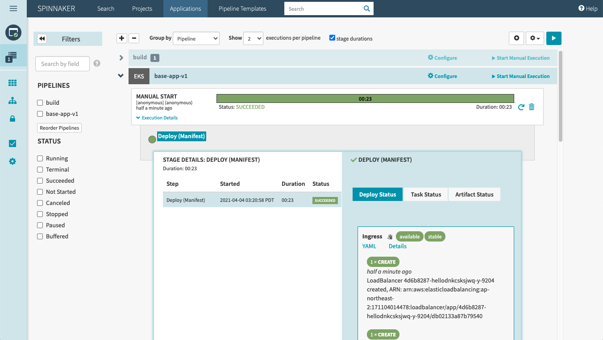

배포가 성공했으면, 스핀에커 왼 쪽의 메뉴에서 클러스터를 누릅니다. 컨테이너 정보들이 나타날 것입니다. 왼 쪽 메뉴의 로드 발란서를 누르면 쿠버네티스 인그레스와 서비스가 표시됩니다. 인그레스를 선택하면 화면 오른 쪽에 자세한 정보가 표시되며, 접속 도메인이 표시됩니다.


#### 메시드 애플리케이션
이 단계에서는 기본 애플리케이션에 서비스 메시(AWS App Mesh)를 적용합니다. 새 파이프라인을 생성합니다. 화면 오른 쪽 윗 부분에 파이프라인 생성 단추가 있습니다. 파이프라인 이름으로 `meshed-app-v1` 입력하고 확인을 누릅니다. *Add stage* 를 눌러서 스테이지의 종류를 선택합니다. 이 번에는 배포를 할 것이므로 *Deploy (Manifest)* 를 선택합니다.

필요한 정보를 선택합니다. Account는 *eks* 를 선택하고 Namespace는 *Override Namespace* 를 눌러서 나오는 목록 중 *hello* 로 시작하는 것을 선택합니다. (네임스페이스 이름의 뒷 10자리는 테라폼을 수행할 때 자동으로 지정되는 중복방지 일련번호이므로 상황에 따라 달라질 수 있습니다)

 - **Account:** eks
 - **Namespace:** hello-xxxxx-yyyyy

배포할 애플리케이션 설정 파일을 지정하기 위해서 S3 화면으로 이동합니다. *artifact-xxxx-yyyy* 버켓으로 이동해서 *2-meshed-app-v1.yaml* 을 선택합니다. 객체에 대한 자세한 정보를 표시하는 화면으로 이동했다면, S3 객체 URI 앞에 있는 작은 사각형이 두 개 겹쳐있는 모양을 누릅니다. *S3 URI 복사됨* 팝업을 확인했으면, 다시 스핀에커 파이프라인 편집 화면으로 돌아갑니다.

배포환경 설정을 이어서 진행합니다.

 + 매니페스트 소스를 아티팩트로 지정합니다.
   - **Manifest Source:** Artifact

 + 매니페스트 소스의 세부 설정을 지정합니다. *Manifest Artifact* 옆의 목록을 누르면 *Define a new artifact* 문구가 나타납니다. 눌러서 선택하면 여러 추가 정보들을 입력하는 화면이 나타납니다. 여기서 *Account* 를 아래와 같이 선택합니다. Object Path 부분에는 앞에서 복사한 S3 URI를 붙여넣으면 됩니다. Object Path 부분에는 앞에서 복사한 S3 URI를 붙여넣으면 됩니다.
   - **Account:** platform
   - **Object Path:** s3://artifact-xxxx-yyyy/2-meshed-app-v1.yaml

화면 맨 아래 *Save Changes*를 눌러서 저장합니다.
저장 후 변경사항이 반영 된 것을 확인했으면, 파이프라인 빠져 나오기 화살표를 눌러서 파이프라인 편집 화면 밖으로 이동합니다. 화면 위 쪽, *build*라고 되어 있는 파이프라인 이름 옆에 작은 화살표가 있습니다.

파이프라인 설정이 되었으면, *Start Manual Execution* 을 눌러서 파이프라인을 실행합니다.

#### 사이드카 주입
App Mesh를 생성했지만, 애플리케이션은 여전히 이전 상태로 동작하고 있습니다. 그래서 *Rolling Restart* 를 실행해서 포드가 재시작하도록 해야 합니다. 포드를 재시작할 때 사이드카 프록시도 함께 주입됩니다. 클러스터 화면에 표시된 모든 DB, Redis, Appserver, UI 디플로이먼트 재시작 합니다. 잠시 기다리면 v002 클러스터가 생깁니다. 4개의 디플로이먼트가 v002로 표시되면 재시작을 완료한 것입니다.


애플리케이션이 새 버전(v002)으로 표시되면 포드를 선택하고, 오른 쪽의 자세히 보기 화면에서 *Console Ourput* 을 누릅니다. 그러면 아래와 같이 포드 안의 컨테이너들의 로그를 볼 수 있습니다. ENVOY, XRAY_DAEMON이 함께 보인다면 제대로 반영된 것입니다.

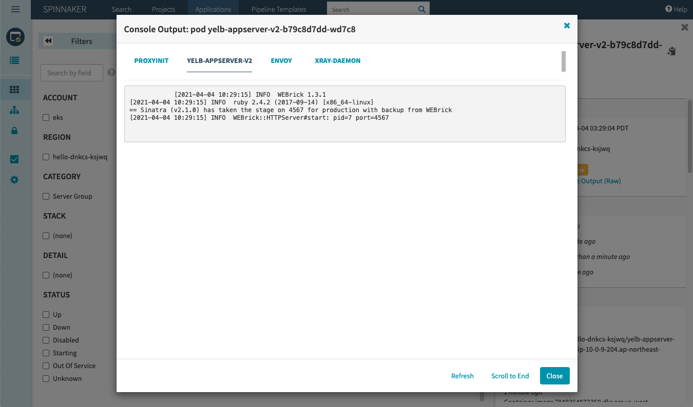

#### 가중치 기반 라우팅
이제 새 버전의 애플리케이션 서버를 배포합니다. AWS CodeBuild 파이프라인에서 생성한 새로운 컨테이너 이미지를 이용하여 배포할 것 입니다. 먼저, 새 파이프라인을 생성합니다. 화면 오른 쪽 윗 부분에 파이프라인 생성 단추가 있습니다. 파이프라인 이름으로 `meshed-app-v2` 입력하고 확인을 누릅니다. *Add stage* 를 눌러서 스테이지의 종류를 선택합니다. 이 번에는 배포를 할 것이므로 *Deploy (Manifest)* 를 선택합니다.

필요한 정보를 선택합니다. Account는 *eks* 를 선택하고 Namespace는 *Override Namespace* 를 눌러서 나오는 목록 중 *hello* 로 시작하는 것을 선택합니다.

 - **Account:** eks
 - **Namespace:** hello-xxxxx-yyyyy

배포할 애플리케이션 설정 파일을 지정하기 위해서 S3 화면으로 이동합니다. *artifact-xxxx-yyyy* 버켓으로 이동해서 *3-meshed-app-v2.yaml* 을 선택합니다. 객체에 대한 자세한 정보를 표시하는 화면으로 이동했다면, S3 객체 URI 앞에 있는 작은 사각형이 두 개 겹쳐있는 모양을 누릅니다. *S3 URI 복사됨* 팝업을 확인했으면, 다시 스핀에커 파이프라인 편집 화면으로 돌아갑니다.

배포환경 설정을 이어서 진행합니다.

 + 매니페스트 소스를 아티팩트로 지정합니다.
   - **Manifest Source:** Artifact

 + 매니페스트 소스의 세부 설정을 지정합니다. *Manifest Artifact* 옆의 목록을 누르면 *Define a new artifact* 문구가 나타납니다. 눌러서 선택하면 여러 정보들을 입력하는 화면이 나타납니다. 여기서 *Account* 를 아래와 같이 선택합니다. Object Path 부분에는 앞에서 복사한 S3 URI를 붙여넣으면 됩니다. Object Path 부분에는 앞에서 복사한 S3 URI를 붙여넣으면 됩니다.
   - **Account:** platform
   - **Object Path:** s3://artifact-xxxx-yyyy/3-meshed-app-v2.yaml

화면 맨 아래 *Save Changes*를 눌러서 저장합니다. 저장 후 변경사항이 반영 된 것을 확인했으면, 파이프라인 빠져 나오기 화살표를 눌러서 파이프라인 편집 화면 밖으로 이동합니다. 화면 위 쪽, *build*라고 되어 있는 파이프라인 이름 옆에 작은 화살표가 있습니다.

파이프라인 설정이 되었으면, *Start Manual Execution* 을 눌러서 파이프라인을 실행합니다.

새로운 버전의 애플리케이션이 배포가 되었지만, ALB를 통해서 접속한 서비스는 '새로고침'을 반복해도 변화가 없습니다. 컨테이너만 배포를 했을 뿐, App Mesh에서 트래픽을 새 버전의 서버로 보내지 않고 있기 때문입니다. 이제 새 버전의 애플리케이션 서버에도 트래픽을 보내도록 설정합니다. 예제에서는 50:50으로 예전 서버와 새 버전의 서버로 트래픽을 보내도록 설정할 것입니다. 화면 오른 쪽 윗 부분에 파이프라인 생성 단추를 눌러서 새 파이프라인을 생성합니다. 파이프라인 이름으로 `weighted-route` 입력하고 확인을 누릅니다. *Add stage* 를 눌러서 스테이지의 종류를 선택합니다. 이 번에는 배포를 할 것이므로 *Deploy (Manifest)* 를 선택합니다.

필요한 정보를 선택합니다. Account는 *eks* 를 선택하고 Namespace는 *Override Namespace* 를 눌러서 나오는 목록 중 *hello* 로 시작하는 것을 선택합니다.

 - **Account:** eks
 - **Namespace:** hello-xxxxx-yyyyy

배포할 애플리케이션 설정 파일을 지정하기 위해서 S3 화면으로 이동합니다. *artifact-xxxx-yyyy* 버켓으로 이동해서 *4-weighted-route.yaml* 을 선택합니다. 객체에 대한 자세한 정보를 표시하는 화면으로 이동했다면, S3 객체 URI 앞에 있는 작은 사각형이 두 개 겹쳐있는 모양을 누릅니다. *S3 URI 복사됨* 팝업을 확인했으면, 다시 스핀에커 파이프라인 편집 화면으로 돌아갑니다.

배포환경 설정을 이어서 진행합니다.

 + 매니페스트 소스를 아티팩트로 지정합니다.
   - **Manifest Source:** Artifact

 + 매니페스트 소스의 세부 설정을 지정합니다. *Manifest Artifact* 옆의 목록을 누르면 *Define a new artifact* 문구가 나타납니다. 눌러서 선택하면 여러 정보들을 입력하는 화면이 나타납니다. 여기서 *Account* 를 아래와 같이 선택합니다. Object Path 부분에는 앞에서 복사한 S3 URI를 붙여넣으면 됩니다. Object Path 부분에는 앞에서 복사한 S3 URI를 붙여넣으면 됩니다.
   - **Account:** platform
   - **Object Path:** s3://artifact-xxxx-yyyy/4-weighted-route.yaml

화면 맨 아래 *Save Changes*를 눌러서 저장합니다.
저장 후 변경사항이 반영 된 것을 확인했으면, 파이프라인 빠져 나오기 화살표를 눌러서 파이프라인 편집 화면 밖으로 이동합니다. 화면 위 쪽, *build*라고 되어 있는 파이프라인 이름 옆에 작은 화살표가 있습니다. 파이프라인 설정이 되었으면, *Start Manual Execution* 을 눌러서 파이프라인을 실행합니다.

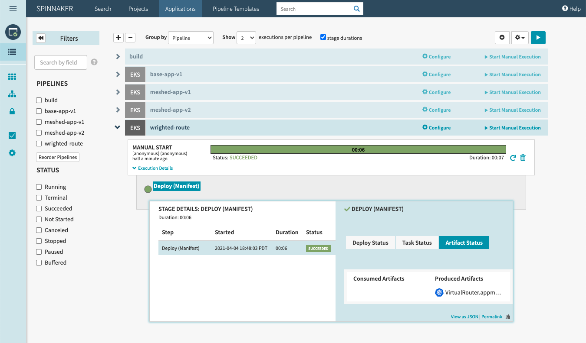

ALB를 통해서 접속한 서비스에서 '새로고침'을 반복하면 화면 하단의 애플리케이션 서버 버전 표시가 변경되는 것을 볼 수 있습니다.

## 정리
실습 자원을 정리하기 위하여 다음 명령을 실행합니다:
```
./preuninstall.sh
terraform destroy --auto-approve
```
