[[English](README.md)] [[한국어](README.ko.md)]
# AWS Application Modernization with Spinnaker


## Prerequisites

:warning: **This example requires the aws cli version 2.5.8 or higher**

We use [Terraform](https://terraform.io), and [Kubernetes](https://kubernetes.io/) in this lab. Please visit the main [page](https://github.com/Young-ook/terraform-aws-spinnaker#terraform) and follow the installation instructions if you don't have terraform cli (command-line interface) in your workspace. And also, make sure that you have kubernetes cli. Here is the official web [page](https://kubernetes.io/docs/tasks/tools/#kubectl) and follow the instructions to install kubernetes cli. In this workshop, aws cli version 2.5.8 or higher is required. For aws cli install guide, please refer to the main [page](https://github.com/Young-ook/terraform-aws-spinnaker#aws-cli). And here is [troubleshooting guide](https://github.com/Young-ook/terraform-aws-fis#unknown-parameter) if you see 'unknown parameter' error message.

### AWS CLI
If you are on cloud9 workspace, you can upgrade or install the aws-cli-v2 using simple command:
```sh
curl "https://awscli.amazonaws.com/awscli-exe-linux-x86_64.zip" -o "awscliv2.zip"
unzip awscliv2.zip
sudo ./aws/install
```

### Kubernetes CLI
Also, you can install kubectl (kubernetes-cli) on your cloud9 environment:
```sh
curl -LO https://storage.googleapis.com/kubernetes-release/release/`curl -s https://storage.googleapis.com/kubernetes-release/release/stable.txt`/bin/linux/amd64/kubectl
chmod +x ./kubectl
sudo mv ./kubectl /usr/local/bin/kubectl
```

### Terraform CLI
And you can install terraform-cli:
```sh
export TF_VER=1.0.3
curl --silent --location "https://releases.hashicorp.com/terraform/${TF_VER}/terraform_${TF_VER}_linux_amd64.zip" -o /tmp/terraform.zip
unzip /tmp/terraform.zip -d /tmp
sudo mv -v /tmp/terraform /usr/local/bin/terraform
```

## Download example
Download this example on your workspace
```sh
git clone https://github.com/Young-ook/terraform-aws-spinnaker
cd terraform-aws-spinnaker/examples/aws-modernization-with-spinnaker
```

## Terraform Backend
Terraform backend stores and manages the state of resources created using Terraform. By defaut, without additional user configuration, it exists as a file in the local workspace that performs terraform run. This is called a local backend. This local backend is currently inconvenient to manage and share the up-to-date state of resources. So, you can use S3 and DynamoDB to support collaboration, and have a backend that keeps the state of the created resource in a storage with stability.

```sh
cd backend
terraform init
terraform apply
```

When you finish creating the Terraform backend, it will generate configuration file specifying the Terraform backend in the same directory. When you open the file, the content is similar as below. You will see The name of the S3 bucket to store the Terraform state in the generated configuration file. More information is in the [terraform-aws-tfstate](https://github.com/Young-ook/terraform-aws-tfstate) repository.
```sh
terraform {
  backend "s3" {
    region = "ap-northeast-2"
    bucket = "hello-tfstate-gyyqc"
    key    = "state"
  }
}
```

Move the generated terraform configuration file to the workspace, actually, the parent directory.
```sh
mv backend.tf ../
cd ../
```

## Setup
This is an aws modern application with hashicorp and spinnaker. The [main.tf](main.tf) is the terraform configuration file to create network infrastructure and kubernetes cluster, and spinnaker on your AWS account.

Run terraform:
```sh
terraform init
terraform apply -target module.foundation
```

To set up DevOps platform to another VPC, run below command:
```sh
terraform apply -target module.platform
```

## Access Spinnaker
Halyard is a command-line administration tool that manages the lifecycle of your spinnaker deployment, including writing & validating your deployment’s configuration, deploying each of spinnaker’s microservices, and updating the deployment. All production-capable deployments of spinnaker require halyard in order to install, configure, and update spinnaker. To install spinnaker using halyard, run script:
```sh
./halconfig.sh
```

After installation and configuration is complete, start port-forwarding through the kubernetes proxy.
```sh
./tunnel.sh
```
Open `http://localhost:8080` on a web browser. Or if your are running this example in Cloud9, click `Preview` and `Preview Running Application`. This opens up a preview tab and shows the spinnaker application.


🎉 Congrats, you’ve deployed the spinnaker on your kubernetes cluster.

## Application (Microservice)
An application is a microservice in spinnaker. When you log in to Spinnaker, there is a *Create Application* button in the upper right corner, click it to create a new application. And fill in the name and email fields. Enter your application name as *yelb* and your email address as Email.

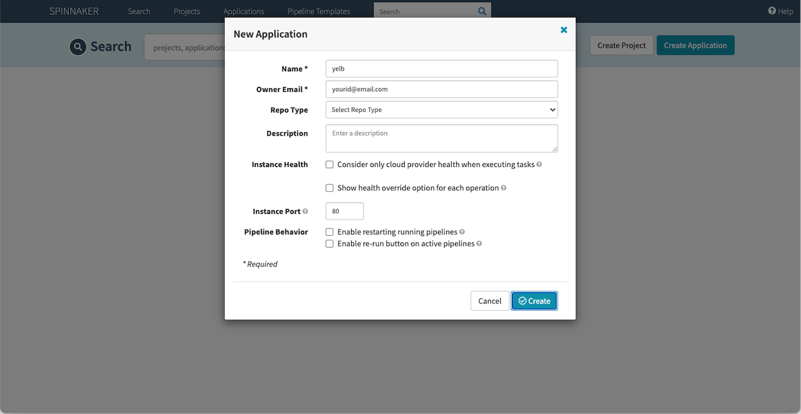

### Service Mesh Pipeline
Automating the process of building and deploying an application is called a pipeline. Sometimes expressed as a workflow, but continuous delivery uses the term pipeline. Now let's move on to the next step and create our first pipeline.

Now that we have created the **yelb** application, we need to create a pipeline within it. Enter a pipeline name by clicking *Create New Pipeline* that appears on the screen. Enter `service-mesh` and press *Create* to bring up a screen where you can edit your pipeline.


#### Build Stage
In this lab, we build the container image using AWS CodeBuild. If the build is successful, the container image is saved to ECR and the Kubernetes manifest file is saved to the S3 bucket. The S3 bucket name is randomly added when Terraform creates it. If you look up the bucket in the S3 service, you will see a bucket with a name of the form *artifact-xxxx-yyyy*. Please note the bucket name separately as it is required for pipeline setup.

To add a build step to the pipeline, you can click *Add Stage*. Choose *AWS CodeBuild* here. A space will then appear below where you can enter the necessary information for the build task.


Please enter the required information (The last 10 characters of the project name are anti-duplication serial automatically assigned by Terraform, and may vary depending on the situation).

 - **Account:** platform
 - **Project Name:** yelb-hello-xxxxx

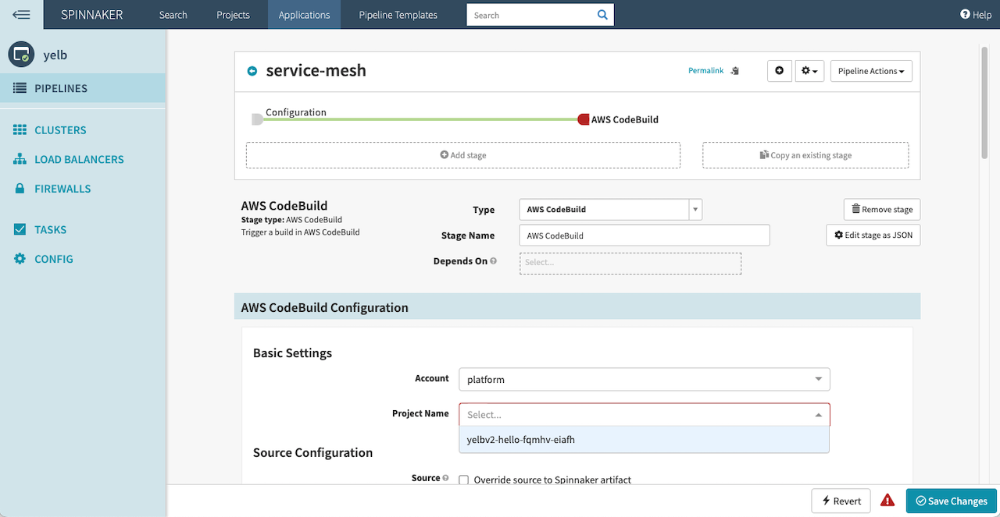

Click *Save Changes* at the bottom of the screen to save. Verfy your changes are reflected properly.

#### Deploy Base Application Stage
Deploy the container application with default settings. Deploy the database, cache, application server, and UI server. In this step, we also apply the service mesh (AWS App Mesh) to the base application. Click *Add stage* to select the type of stage. This time we are going to deploy, so we choose *Deploy (Manifest)* .

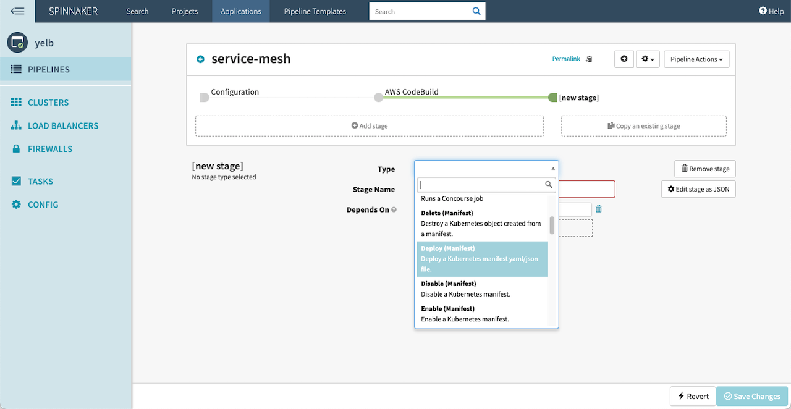

Select the required information. Select *eks* for Account and *Override Namespace* for Namespace and choose the list that starts with *hello*.

 - **Account:** eks
 - **Namespace:** hello-xxxxx

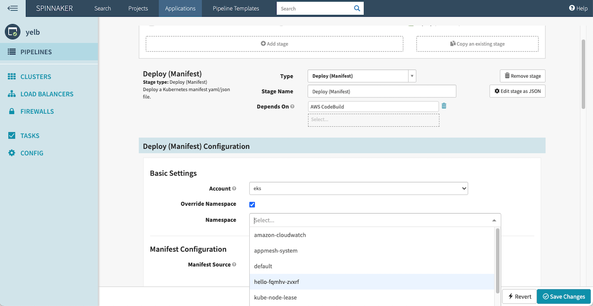

Continue setting up your deployment environment.

 + Specifies the manifest source as an artifact.
   - **Manifest Source:** Artifact

 + Specify detailed settings for the manifest source. When you click the list next to *Manifest Artifact*, the text *Define a new Artifact* appears. If you press to select, a screen for entering various additional information appears. Here, select *Account* as shown below. And, fill out the *Object Path* field with the full S3 URI of `1.app-v1.yaml` file.

   - **Account:** platform
   - **Object Path:** s3://artifact-xxxx-yyyy/1.app-v1.yaml


We design the pipeline to wait a while before moving on to the next step of deployment stage. To add an approval process, click *Add Step* and then select *Manual Judgment*.


Click *Save Changes* at the bottom of the screen to save. Verfy your changes are reflected properly.

#### Deploy New Application Stage
Now configure the pipeline stage to deploy the new version of the application server. Deploy using the new container image created by the AWS CodeBuild pipeline. Click *Add Stage* to select a stage type. This time we are going to deploy, so we choose *Deploy (Manifest)* .

Select the required information. Choose *eks* for Account, *Override Namespace* for Namespace, and select the list that starts with *hello*.

 - **Account:** eks
 - **Namespace:** hello-xxxxx

Continue setting up your deployment environment.

 + Specifies the manifest source as an artifact.
   - **Manifest Source:** Artifact

 + Specify detailed settings for the manifest source. When you click the list next to *Manifest Artifact*, the text *New Artifact Definition* appears. If you press and select, a screen for entering various information appears. Here, select *Account* as shown below. And, fill out the *Object Path* field with the full S3 URI of `2.app-v2.yaml` file.

   - **Account:** Platform
   - **object path:** s3://artifact-xxxx-yyyy/2.app-v2.yaml

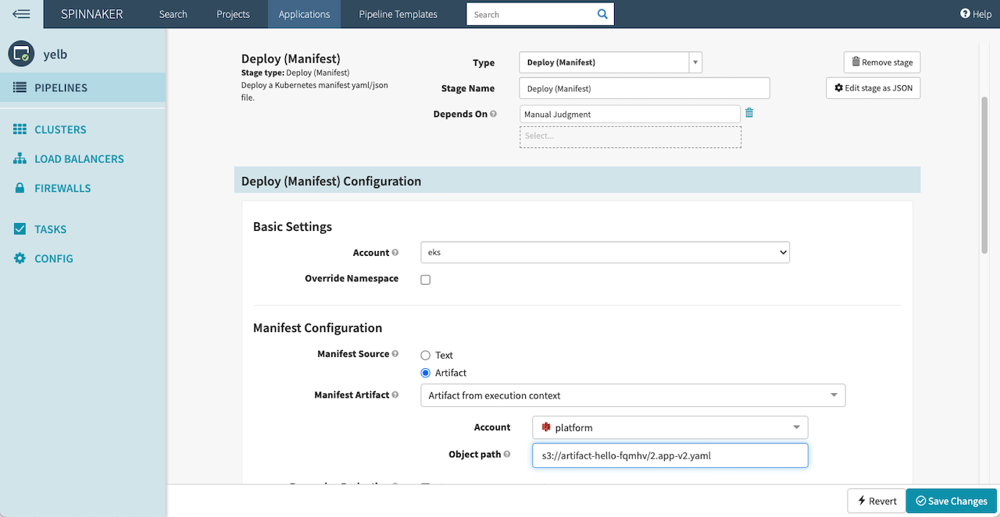

We design the pipeline to wait a while before moving on to the next step of deployment stage. To add an approval process, click *Add Step* and then select *Manual Judgment*.

Click *Save Changes* at the bottom of the screen to save. Verfy your changes are reflected properly.

#### Weighted Route Stage
After the approval step has been added, add a new stage to apply the weighted route configuration. Click *Add Stage* to select a stage type. This time we are going to deploy, so we choose *Deploy (Manifest)*.

Select the required information. Choose *eks* for Account, *Override Namespace* for Namespace, and select the list that starts with *hello*.

 - **Account:** eks
 - **Namespace:** hello-xxxxx

Continue setting up your deployment environment.

 + Specifies the manifest source as an artifact.
   - **Manifest Source:** Artifact

 + Specify detailed settings for the manifest source. When you click the list next to *Manifest Artifact*, the text *New Artifact Definition* appears. If you press and select, a screen for entering various information appears. Here, select *Account* as shown below. And, fill out the *Object Path* field with the full S3 URI of `3.weighted-route.yaml` file.

   - **Account:** Platform
   - **object path:** s3://artifact-xxxx-yyyy/3.weighted-route.yaml


Click *Save Changes* at the bottom of the screen to save. Verfy your changes are reflected properly.

### Run Pipeline
After saving and verifying that your changes are reflected, click the *End Pipeline* arrow to navigate to the Edit Pipeline screen. At the top of the screen, there is a small arrow next to the pipeline name *service-mesh*.

After setting up your pipeline, click *Start Manual Execution* to run your pipeline. The CodeBuild project will start building, which will take about 2 minutes.

If the build is successful, enter the AWS console and go to the ECR service screen. The newly created container image appears. And go to the S3 service screen. The bucket list contains buckets with names of the form *artifact-xxxx-yyyy*. Press the appropriate bucket to get inside. You will see the build results.

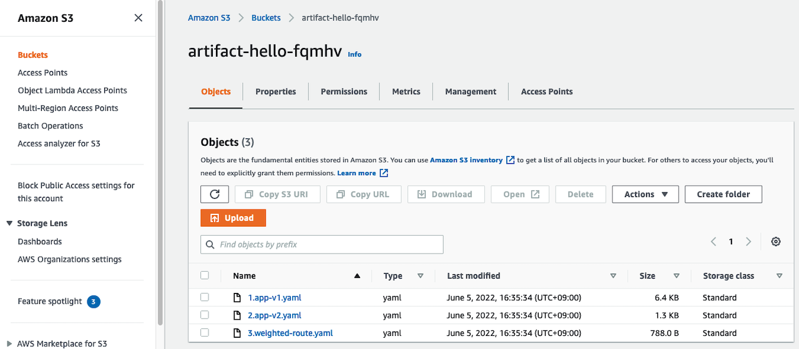

If the deployment is successful, click Clusters in the menu on the left side of the Spinnaker screen. Container information appears. Select the pod and press *Console Output* in the details view on the right side of screen. Then you can see the log of the container in the pod as shown below. When ENVOY and XRAY_DAEMON are displayed together, they are properly reflected.


Then, click Load Balancers in the navigation bar to display Kubernetes ingress and services. If you select Ingress, detailed information is displayed on the right side of the screen, and the access domain is displayed. Click the displayed load balancer DNS name to open the application in a new tab or window. You can see the application is working properly.

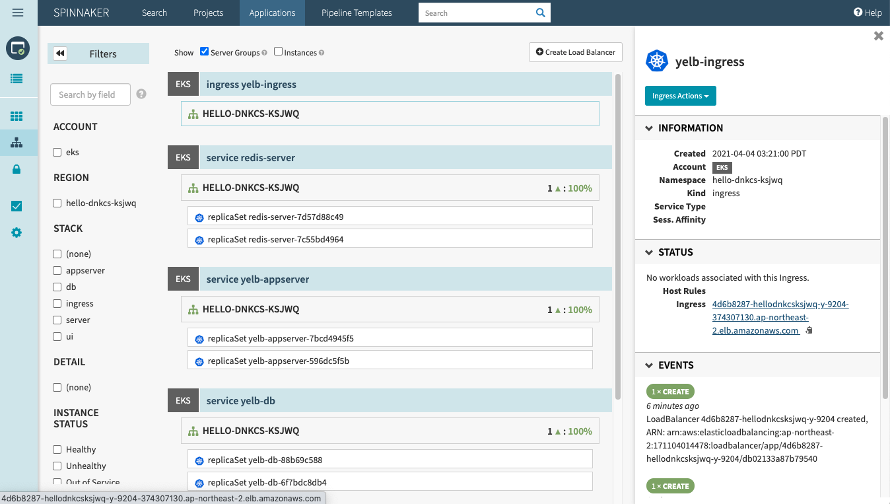

The pipeline has only performed the first deployment, and is waiting in the approval stage before proceeding to the next stage of deploying a new version of the application. Once you have verified that the base application is working well, proceed to the next step. Press the *Continue* button to deploy a new version of the application server.

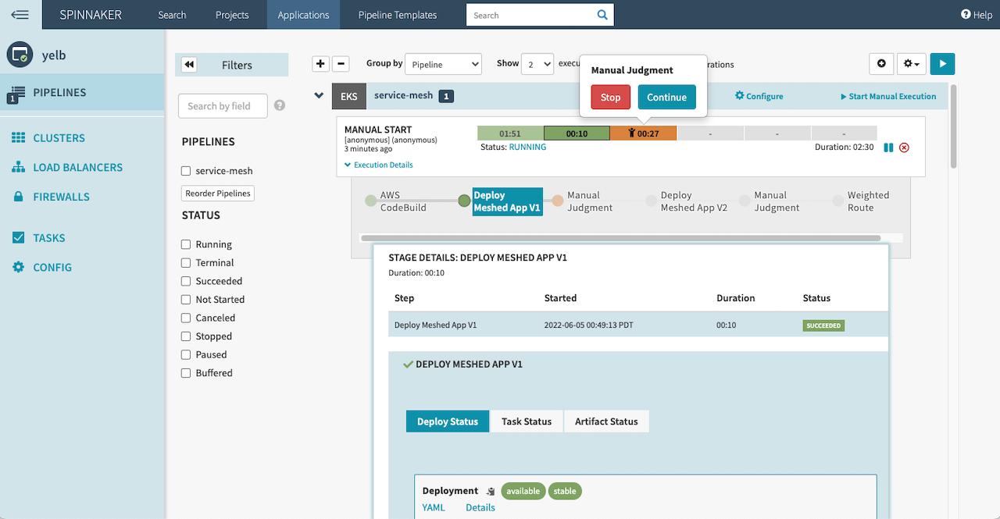

Even though a new version of the application is deployed, you can't access it even if you repeat 'refresh' on your web browser. This is because you only deploy containers and App Mesh doesn't direct traffic to the new version of the server. Now set it to send traffic to the new version of the application server as well. This example sets the traffic to be sent to the old server and the new version server at 50:50. When the new application deployment task is complete, a request approval popup appears. This is the process of waiting a while before applying weighted traffic control. Press the *Continue* button to move forward. 


Now, if you repeat 'refresh' in your web browser, you can see that the application server version displayed at the bottom of the screen has changed.

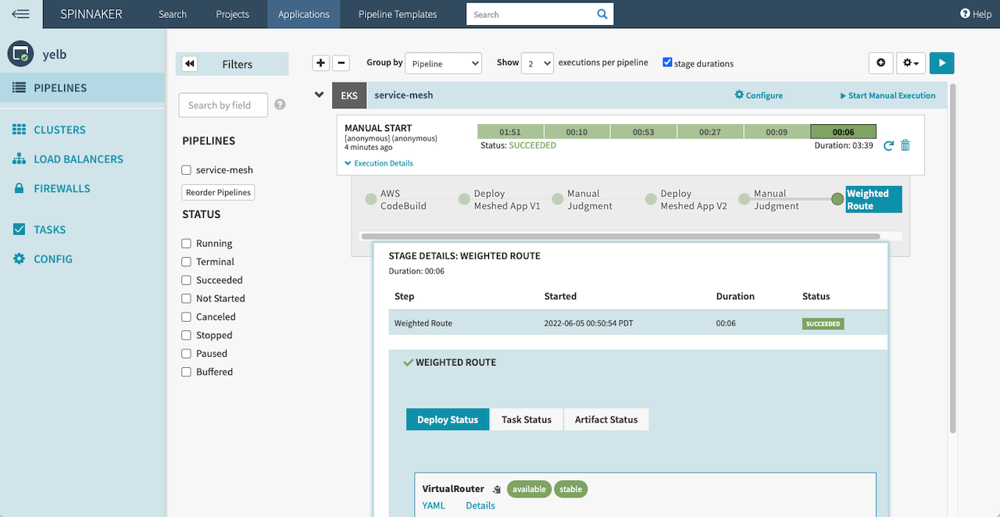

## Observability
Let’s see if the application works. In this workshop, Container Insights(Metrics, Logs) and X-Ray(Trace) agents are already installed and enabled. Move to the CloudWatch service page on the AWS Console for monitoring. You can see metrics and trace map when you select *Container Insights* or *Service Lens* menu on the navigation bar. Here are screenshots of observability example.


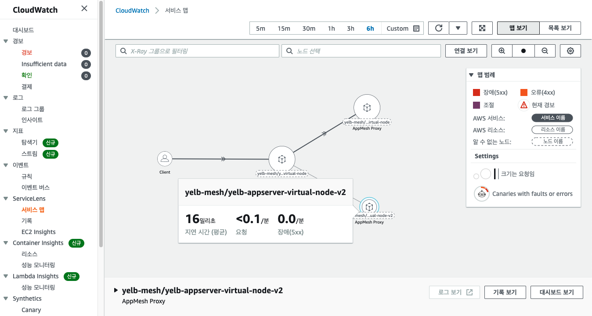
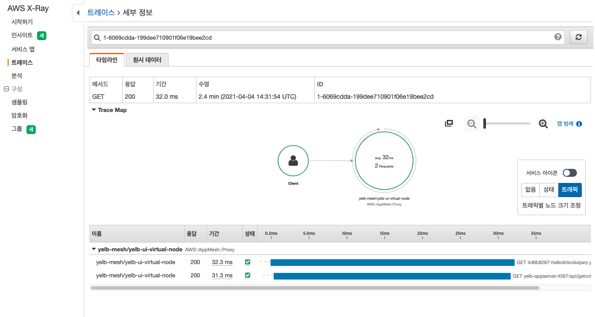

## Chaos Engineering
Chaos engineering is the process of testing a distributed computing system to ensure that it can withstand unexpected disruptions. The goal of chaos engineering is to identify and remediate weakness in a system through controlled experiments that introduce random and unpredictable behavior. Therefore, Chaos engineering is NOT about breaking thingsrandomly without a purpose, chaos engineering is about breaking things in a controlled environment and through well-planned experiments in order to build confidence in your application to withstand turbulent conditions. For more information, please visit [this](https://github.com/Young-ook/terraform-aws-fis).

#### Define Steady State
Before we begin a failure experiment, we need to validate the user experience and revise the dashboard and metrics to understand that the systems are working under normal state, in other words, steady state.

Let’s go ahead and explore the application. Some things to try out:
1. Vote a restaurant that you love.
1. Refresh your browser several times and check the number of refreshes at the bottom of the screen.
1. Check the status of all CloudWatch alarms are OK.


#### Hypothesis
The experiment we’ll run is to verify and fine-tune our application availability when compute nodes are terminated accidentally. The application is deployed as a container on the Kubernetes cluster, we assume that if some nodes are teminated, the Kubernetes control plane will reschedule the pods to the other healthy nodes. In order for chaos engineering to follow the scientific method, we need to start by making hypotheses. To help with this, you can use an experiment chart (see below) in your experiment design. We encourage you to take at least 5 minutes to write your experiment plan.

**Steady State Hypothesis Example**

+ Title: Services are all available and healthy
+ Type: What are your assumptions?
   - [ ] No Impact
   - [ ] Degraded Performance
   - [ ] Service Outage
   - [ ] Impproved Performance
+ Probes:
   - Type: CloudWatch Metric
   - Status: `service_number_of_running_pods` is greater than 0
+ Stop condition (Abort condition):
   - Type: CloudWatch Alarm
   - Status: `service_number_of_running_pods` is less than 1
+ Results:
   - What did you see?
+ Conclusions:
   - [ ] Everything is as expected
   - [ ] Detected something
   - [ ] Handleable error has occurred
   - [ ] Need to automate
   - [ ] Need to dig deeper

#### Run Experiment
Make sure that all your EKS node group instances are running. Go to the AWS FIS service page and select `TerminateEKSNodes` from the list of experiment templates. Then use the on-screen `Actions` button to start the experiment. AWS FIS shuts down EKS nodes for up to 70% of currently running instances. In this experiment, this value is 40% and it is configured in the experiment template. You can edit this value in the target selection mode configuration if you want to change the number of EKS nodes to shut down. You can see the terminated instances on the EC2 service page, and the new instances will appear shortly after the EKS node is shut down.


You can see some pods being shut down in the cluster. Here is an example showing that the yelb-appserver pod is down.


And the application is not working properly. It looks like partially demaged.


#### Discussion
Then access the microservices application again. What happened? Perhaps a node shutdown by a fault injection experiment will cause the application to crash. This is because the first deployment of the application did not consider high availability (stateless, immutable, replicable) characteristics against single node or availability-zone failure. In the next stage, you will learn how to improve the architecture for reliabiliy and high availability.

Before we move to the next step, we need to think about one thing. In this experiment, business healthy state (steady state) is specified as cpu utilization and number of healthy pods. But after the first experiment, you will see the service does not work properly even though the monitoring indicators are in the normal range. It would be weird it is also meaningful. This result shows that unintended problems can occur even if the monitoring numbers are normal. It could be one of the experimental results that can be obtained through chaos engineering.

Go forward.

#### Architecture Improvements
Cluster Autoscaler is a tool that automatically adjusts the size of the Kubernetes cluster when one of the following conditions is true:
+ there are pods that failed to run in the cluster due to insufficient resources.
+ there are nodes in the cluster that have been underutilized for an extended period of time and their pods can be placed on other existing nodes.

Cluster Autoscaler provides integration with Auto Scaling groups. Cluster Autoscaler will attempt to determine the CPU, memory, and GPU resources provided by an EC2 Auto Scaling Group based on the instance type specified in its Launch Configuration or Launch Template. Click [here](https://github.com/kubernetes/autoscaler/tree/master/cluster-autoscaler/cloudprovider/aws) for more information.

Cluster Autoscaler is already installed. You can see the configuration code at the bottom of the [foundation/main.tf](foundation/main.tf).

Let's scale out pods and apply pod-anti-affinity policy for high availability.


Back to Spinnaker and move to the **yelb** application, create a pipeline with `chaos-engineering`. Press *Create* to bring up a screen where you can edit your pipeline. Next, click the *Add Stage* button to add a deploy step to the pipeline. And Chosse *Deploy (Manifest)*.


Select the required information. Choose *eks* for Account, *Override Namespace* for Namespace, and select the list that starts with *hello*.

 - **Account:** eks
 - **Namespace:** hello-xxxxx

Continue setting up your deployment environment.

 + Specifies the manifest source as an artifact.
   - **Manifest Source:** Artifact

 + Specify detailed settings for the manifest source. When you click the list next to *Manifest Artifact*, the text *New Artifact Definition* appears. If you press and select, a screen for entering various information appears. Here, select *Account* as shown below. And, fill out the *Object Path* field with the full S3 URI of `4.high-availability.yaml` file.

   - **Account:** Platform
   - **object path:** s3://artifact-xxxx-yyyy/4.high-availability.yaml


Click *Save Changes* at the bottom of the screen to save. Verfy your changes are reflected properly.

#### Rerun Experiment
After saving and verifying that your changes are reflected, click the *End Pipeline* arrow to navigate to the Edit Pipeline screen. At the top of the screen, there is a small arrow next to the pipeline name *chaos-engineering*. Then, click *Start Manual Execution* to run your pipeline.

Back to the AWS FIS service page, and rerun the terminate eks nodes experiment against the target to ensure that the microservices application is working in the previously assumed steady state.

## Clean up
On the screen port-forward logs are shown. Press *ctrl + c* keys to exit port-forward process. Next, run commands:
```sh
./preuninstall.sh
terraform destroy --auto-approve
```

It may take servral menuites until delete whole Kubernetes resources including namespace from your cluster. Then, delete terraform (state) backend. Move to the terraform backend configuration directory and run terraform destroy command:
```sh
rm backend.tf
cd backend
terraform destroy --auto-approve
```

Next, Go to the AWS Management Console and get to CloudWatch service page. Select Log groups on the navigation bar on the left of the screen. Enter `hello` for filtering. When log groups start form `/aws/codebuild`, `/aws/containerinsights/` appear, choose them and delete like belows.

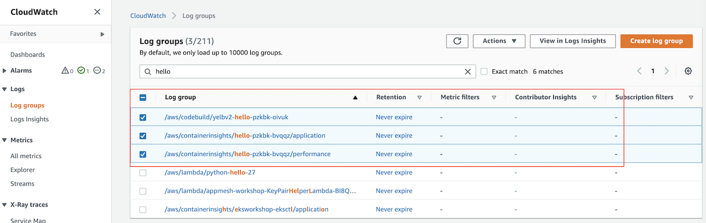

## Additional Resources
- [Terraform module: Amazon EKS (Elastic Kubernetes Service)](https://registry.terraform.io/modules/Young-ook/eks/aws/latest)
- [Terraform module: Amazon VPC (Virtual Private Cloud)](https://registry.terraform.io/modules/Young-ook/vpc/aws/latest)
- [Terraform module: AWS CodeBuild](https://github.com/Young-ook/terraform-aws-spinnaker/blob/main/modules/codebuild)
- [Terraform module: AWS FIS (Fault Injection Simulator)](https://registry.terraform.io/modules/Young-ook/fis/aws/latest)
- [Terraform module: AWS IAM (Identity Access Management)](https://registry.terraform.io/modules/Young-ook/passport/aws/latest)
- [Terraform module: Terraform Backend](https://registry.terraform.io/modules/Young-ook/tfstate-backend/aws/latest)
