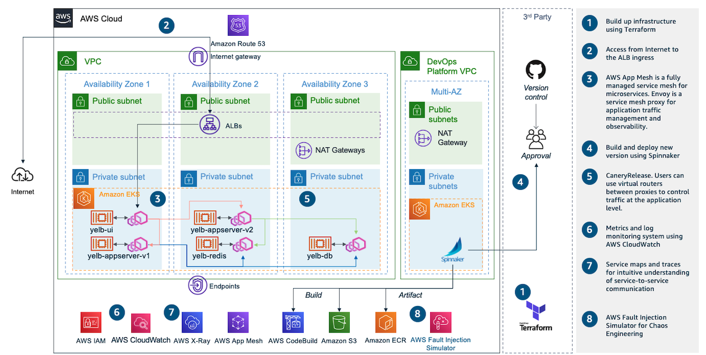

# AWS Application Modernization with Spinnaker



## Setup
This is an aws modern application with hashicorp and spinnaker. The [main.tf](main.tf) is the terraform configuration file to create network infrastructure and kubernetes cluster, and spinnaker on your AWS account.

Run terraform:
```
terraform init
terraform apply -target module.foundation
```

To set up DevOps platform to another VPC, run below command:
```
terraform apply -target module.platform
```

## Access Spinnaker
Halyard is a command-line administration tool that manages the lifecycle of your spinnaker deployment, including writing & validating your deployment’s configuration, deploying each of spinnaker’s microservices, and updating the deployment. All production-capable deployments of spinnaker require halyard in order to install, configure, and update spinnaker.

Run command:
```
./halconfig.sh
```

Run command:
```
./tunnel.sh
```
Open http://localhost:8080 on a web browser.

## Clean up
Run command:
```
./preuninstall.sh
terraform destroy
```
