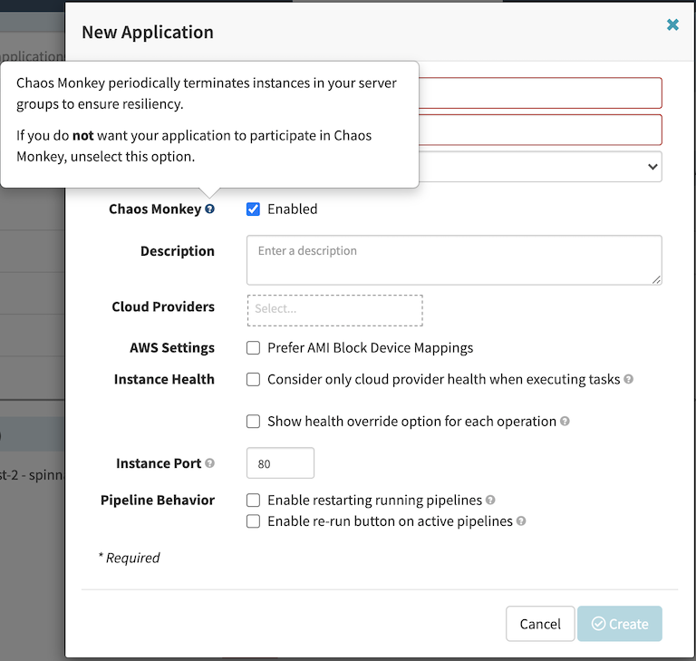

# Spinnaker Blueprint
This is Spinnaker Blueprint example helps you compose complete Spinnaker clusters that are fully bootstrapped with utilities that is needed to deploy and operate workloads. With this Spinnaker Blueprint example, you describe the configuration for the desired state of your continuous delivery platform for your application, as an Infrastructure as Code (IaC) template/blueprint. Once a blueprint is configured, you can use it to stamp out consistent environments across multiple AWS accounts and Regions using your automation workflow tool, such as Jenkins, CodePipeline. Spinnaker Blueprints also helps you implement relevant security controls needed to operate workloads from multiple teams in the same cluster.

## Setup
### Prerequisites
This module requires kubectl, kuberentes command line tool. If you don't have the terraform and kubernetes tools in your environment, go to the main [page](https://github.com/Young-ook/terraform-aws-spinnaker) of this repository and follow the installation instructions.

### Download
Download this example on your workspace
```
git clone https://github.com/Young-ook/terraform-aws-spinnaker
cd terraform-aws-spinnaker/examples/blueprint
```

Then you are in **blueprint** directory under your current workspace. There is an exmaple that shows how to use terraform configurations to create and manage AWS resources and additional utilities, such as Amazon EKS, S3, RDS on your AWS account. Check out and apply it using terraform command. If you don't have the terraform tools in your environment, go to the main [page](https://github.com/Young-ook/terraform-aws-spinnaker) of this repository and follow the installation instructions before you move to the next step.

### Terraform Backend
Terraform backend stores and manages the state of resources created using Terraform. By defaut, without additional user configuration, it exists as a file in the local workspace that performs terraform run. This is called a local backend. This local backend is currently inconvenient to manage and share the up-to-date state of resources. So, you can use S3 and DynamoDB to support collaboration, and have a backend that keeps the state of the created resource in a storage with stability.
```
terraform init
terraform apply -target module.tfstate
```

When you finish creating the Terraform backend, it will generate configuration file specifying the Terraform backend in the same directory. When you open the file, the content is similar as below. You will see The name of the S3 bucket to store the Terraform state in the generated configuration file. More information is in the [terraform-aws-tfstate](https://github.com/Young-ook/terraform-aws-tfstate) repository.
```
terraform {
  backend "s3" {
    region = "ap-northeast-2"
    bucket = "tfstate-gyyqc"
    key    = "state"
  }
}
```
As a new terraform remote backend has been configured for blueprint example, you need to initialize terraform environment again to store terraform state on the remote backend (Amazon S3, Amazon DynamoDB).

Run terraform:
```
terraform init
terraform apply
```
Also you can use the *-var-file* option for customized paramters when you run the terraform plan/apply command.
```
terraform plan -var-file fixture.tc1.tfvars
terraform apply -var-file fixture.tc1.tfvars
```

Spinnaker utilizes cross-account IAM role assuming mechanism to manage multiple AWS accounts. For more information about chained roles using AWS IAM and Security Token Service (STS), please visit the [Cloud Providers](https://github.com/Young-ook/terraform-aws-spinnaker/blob/main/README.md#cloud-providers) configuration. And follow the instructions if you wnat to enable multiple cloud providers.

### Access Halyard
[Spinnaker Halyard](https://github.com/spinnaker/halyard) is a command-line tool for spinnaker setup and management. To access Halyard on your Spinnaker, copy and run the command **halconfig** from the terraform output. This is an example of the output for halyard access script you might see in your terminal after the terraform job is complete. You can access the halyard by copying and running the following command below *bash*.
```
halconfig = bash -e .terraform/modules/spinnaker/scripts/halconfig.sh -r ap-northeast-2 -n spinnaker-xxxx -p spinnaker-halyard-0 -k kubeconfig
```

### Install Spinnaker
Spinnaker version:
```
hal config version edit --version 1.33.0
```

Persistent storage:
```
echo spinnakeradmin | hal config storage s3 edit \
    --endpoint http://spinnaker-minio:9000 \
    --access-key-id spinnakeradmin \
    --secret-access-key --bucket spinnaker \
    --path-style-access true
hal config storage edit --type s3
```

Use deck (UI) as proxy to route to gate (API):
```
hal config security api edit --no-validate --override-base-url /gate
```

Kubernetes providers:
```
hal config provider kubernetes enable
hal config provider kubernetes account add default \
    --context default --service-account true \
    --omit-namespaces=kube-system,kube-public,spinnaker \
    --provider-version v2
```

Spinnaker deployment type:
```
hal config deploy edit --account-name default --type distributed \
    --location spinnaker
```

Deploy:
```
hal deploy apply
```

### Access Spinnaker
Exit halyard interactive prompt, and run the kubectl port-forward command to establish private connection between local machine and the remote spinnaker cluster.

```
export KUBECONFIG=kubeconfig
kubectl -n spinnaker port-forward svc/spin-deck 9000:9000
```


## Cloud Providers
### AWS
Users can add AWS account to spinnaker using halyard which is the command-line tool for spinnaker management. To enable AWS account in the spinnaker, please follow the instructions in the [Spinnaker Managed AWS](https://github.com/Young-ook/terraform-aws-spinnaker/blob/main/modules/spinnaker-managed-aws) example.

### Amazon ECS
And users can enable ECS account in the spinnaker using halyard. Please follow the instructions in the [Spinnaker Managed ECS](https://github.com/Young-ook/terraform-aws-spinnaker/blob/main/modules/spinnaker-managed-ecs) example.

### Amazon EKS
And users can enable Kubernetes account in the spinnaker using halyard. Please follow the instructions in the [Spinnaker Managed EKS](https://github.com/Young-ook/terraform-aws-spinnaker/blob/main/modules/spinnaker-managed-eks) example.

## Pipelines
### CodeBuild
Users can set up AWS CodeBuild as a Continuous Integration (CI) system within spinnaker for cloud backed build system. For more details about codebuild project registration with spinnaker, please visit the [Enable AWS CodeBuild account](https://github.com/Young-ook/terraform-aws-spinnaker/blob/main/modules/codebuild).

First of all, you have to enable halyard interactive mode as described in the previous step.
Then, run halyard command for AWS CodeBuild integration:
```
hal config ci codebuild account add platform \
    --region {{ AWS_REGION }} \
    --account-id {{ AWS_ACCOUNT_ID }} \
    --assume-role {{ SPINNAKER_ASSUMABLE_ROLE }}
hal config ci codebuild enable
```

Also, you can enable an artifact repository:
```
hal config features edit --artifacts true
hal config artifact s3 account add platform --region {{ AWS_REGION }}
hal config artifact s3 enable
```

After configuration change, you must redeploy your spinnaker to apply the changes:
```
hal deploy apply
```

### Chaos Monkey
[Chaos Monkey](https://netflix.github.io/chaosmonkey/) is responsible for randomly terminating instances in production to ensure that engineers implement their services to be resilient to instance failures.

There are many reasons to perform chaos engineering. We see teams across the industry turn to this practice to reduce incidents, lower the cost of downtime, train their team and prepare for moments that matter. In other words, it can also be called vaccination for real events.

**Reduce Incidents**

By practicing chaos engineering you are able to detect issues before they become incidents and before your customers get affected.

**Cost of Downtime**

The cost of downtime is very expensive. The numbers get larger with the companies that operate at web scale, and if it's during a high traffic event like a sale or launch.

**Train your Team**

Give your team a chance to build their muscle memory. Run planned chaos engineering experiments to train engineers on how to be on call and repond to incidents with runbook.

**Prepare for moments that matter**

By working on the three points above your team will feel more confident everyday as they build their respective applications and systems. Less time will be spent fire fighthing and more time building and creating value.


This example also creates CI/CD pipeline for ChaosMonkey for Spinnaker. You will see AWS CodeBuild project and ECR repository on your AWS account to build and deploy Chaos Monkey container into spinnaker after terraform apply.

Chaos Monkey also requires a MySQL-compatible database, version 5.6 or later. The users can utilise the MySQL database installed for spinnaker together. Launch a mysql-client container inside Kubernetes running the spinnaker to access the MySQL database. Run kubectl command:
```
kubectl run mysql-client --image mysql:5.7 --env MYSQL_ROOT_PASSWORD=supersecret
kubectl exec -it mysql-client -- bash
```
```
mysql-client-xxxxxxxxx-yyyyy:/$ mysql -h {endpoint} -P {port} -u {user} -p
mysql>
```
Create a `chaosmonkey` database and `chaosmonkey_service` user. This is an example:
```
CREATE DATABASE chaosmonkey;

GRANT
  SELECT, INSERT, UPDATE, DELETE, CREATE, DROP, REFERENCES, INDEX, ALTER, LOCK TABLES, EXECUTE, SHOW VIEW
ON 'chaosmonkey'.*
TO 'chaosmonkey_service'@'%';

SET PASSWORD FOR 'chaosmonkey_service'@'%' = PASSWORD('changeme');

flush privileges;
```
Finally, exit MySQL and clean up the workspace. This mysql-client container is a temporary resource for initial setup, so we need to remove the access point to the database.
```
kubectl delete po mysql-client
```

#### Upload Chaos Monkey configuration
Chaos Monkey uses [TOML:Tom's Obvious, Minimal Language](https://github.com/toml-lang/toml) format for configuration. See the basic [configuration](chaosmonkey.toml). We need to modify the endpoint, password with the information configured inside the database. That way the application can access the database. We're assuming chaosmonkey runs on the same Kubernetes, so we will not update the spinnaker access point in that toml file. When we are done changing the settings, need to update the file with the configmap of the Kubernetes cluster for sharing. The application will take this configuration from the configmap and use it when running.
```
kubectl -n spinnaker create cm chaosmonkey --from-file chaosmonkey.toml
```
#### Enabling Chaos Monkey in spinnaker
We can enable Chaos Monkey using halyard. Run `kubectl` command to enter the halyard container for configration. To update the feature configuration to enable chaos monkey, run halyard command like following:
```
kubectl -n spinnaker exec -it cd-spinnaker-halyard-0 -- bash
```
```
bash $ hal config features edit --chaos=true
bash $ hal deploy apply
```
If the feature was enabled successfully, when you create a new app with spinnaker, you will see a "Chaos Monkey: Enabled" checkbox in the "New Application" modal dialog. If it does not appear, you may need to deploy a more recent version of spinnaker.



#### Configure Chaos Monkey pipeline
##### Build container image
Finished all previous steps, users can make a spinnaker pipeline to deliver Chaos Monkey deployment on the EKS cluster where the spinnaker is running. Move on the spinnaker and create a new `chaosmonkey` application. Open pipeline tab and select create pipeline button. Spinnaker screen will be changed to pipeline configuration mode, and the users can start editing new pipeline. Add `AWS CodeBuild` stage to connect the CI job.

##### Create the database schema
Once we have created a chaosmonkey database and have populated the configuration file with the database credentials, add the tables to the database. Create a pipeline as `init` in the `chaosmonkey` application that we've made before. And add `Deploy` stage there with below manifest. Then run the pipeline for chaos monkey database initilaization.
```
apiVersion: apps/v1
kind: Deployment
metadata:
  name: chaosmonkey
spec:
  replicas: 1
  selector:
    matchLabels:
      app: chaosmonkey
  template:
    metadata:
      labels:
        app: chaosmonkey
    spec:
      containers:
        - args:
            - migrate
          command:
            - chaosmonkey
          image: {AWS_ACCOUNT_ID}.dkr.ecr.ap-northeast-2.amazonaws.com/chaosmonkey
          name: chaosmonkey
          volumeMounts:
            - mountPath: /go/chaosmonkey.toml
              name: chaosmonkey-config
              subPath: chaosmonkey.toml
      volumes:
        - configMap:
            name: chaosmonkey
          name: chaosmonkey-config
```

##### Terminate instances
Create a pipeine *terminate* in the *chaosmonkey* application and add *Deploy* stage. In the details of *Deploy* stage configuration window, select *default* namespace where the spinnaker is running. It makes sure that chaosmonkey container runs next to the spinnaker. Here is an example of manifest to deploy chaosmonkey container. Don't forget to replace {AWS_ACCOUNT_ID} with your own AWS account number and also modify the arguments of Chaos Monkey command to adopt it to your environment. The arguments *nginx* and *default* are examples of the spinnaker's application name and aws account name, assuming the user wants to termiate. In this example, chaosmonkey will termiate the EC2 instances managed by *default* provider in the *nginx* application in the spinnaker.
```
apiVersion: apps/v1
kind: Deployment
metadata:
  name: chaosmonkey
spec:
  replicas: 1
  selector:
    matchLabels:
      app: chaosmonkey
  template:
    metadata:
      labels:
        app: chaosmonkey
    spec:
      containers:
        - args:
            - terminate
            - nginx
            - default
          command:
            - chaosmonkey
          image: {AWS_ACCOUNT_ID}.dkr.ecr.ap-northeast-2.amazonaws.com/chaosmonkey
          name: chaosmonkey
          volumeMounts:
            - mountPath: /go/chaosmonkey.toml
              name: chaosmonkey-config
              subPath: chaosmonkey.toml
      volumes:
        - configMap:
            name: chaosmonkey
          name: chaosmonkey-config
```


## Clean up
Before you using terraform command to delete all resources, please check the [known issues](https://github.com/Young-ook/terraform-aws-spinnaker/tree/main#hangs-at-destroying) about uninstall.

Run halyard comment to destroy all spinnaker microservices:
```
hal deploy clean
```

To destroy all infrastrcuture, run terraform:
```
terraform destroy
```

If you don't want to see a confirmation question, you can use quite option for terraform destroy command
```
terraform destroy --auto-approve
```

It may take servral menuites until delete whole Kubernetes resources including namespace from your cluster. Then, delete terraform (state) backend. Delete the **backend.tf** from your workspace and rerun terraform destroy command to delete terraform backend resources where recorded on the local terraform state file:
```
rm backend.tf
terraform destroy --auto-approve
```

**[DON'T FORGET]** You have to use the *-var-file* option when you run terraform destroy command to delete the aws resources created with extra variable files.
```
terraform destroy -var-file fixture.tc1.tfvars
```

# Known Issues
## Requires default VPC
You will see error message followings when attempting to run terraform apply in the spinnaker example if you deleted the default vpc on your account:
```
╷
│ Error: no matching VPC found
│
│ with module.spinnaker.module.eks.data.aws_vpc.default,
│ on .terraform/modules/spinnaker.eks/network.tf line 4, in data "aws_vpc" "default":
│ 4: data "aws_vpc" "default"
```
This module uses eks module inside that requires default vpc on your aws account. This is the related [issue](https://github.com/Young-ook/terraform-aws-eks/issues/44). For more details, please refer to the [source](https://github.com/Young-ook/terraform-aws-eks/).

# Additional Resources
- [Sailing with Spinnaker on AWS](https://aws.amazon.com/blogs/opensource/spinnaker-on-aws/)
- [Build a Deployment Pipeline with Spinnaker on Kubernetes](https://aws.amazon.com/blogs/opensource/deployment-pipeline-spinnaker-kubernetes/)
- [Continuous Delivery using Spinnaker on Amazon EKS](https://aws.amazon.com/blogs/opensource/continuous-delivery-spinnaker-amazon-eks/)
- [How to integrate AWS Lambda with Spinnaker](https://aws.amazon.com/blogs/opensource/how-to-integrate-aws-lambda-with-spinnaker/)
- [Managing Spinnaker using Spinnaker Operator in Amazon EKS](https://aws.amazon.com/blogs/opensource/managing-spinnaker-using-spinnaker-operator-in-amazon-eks/)
