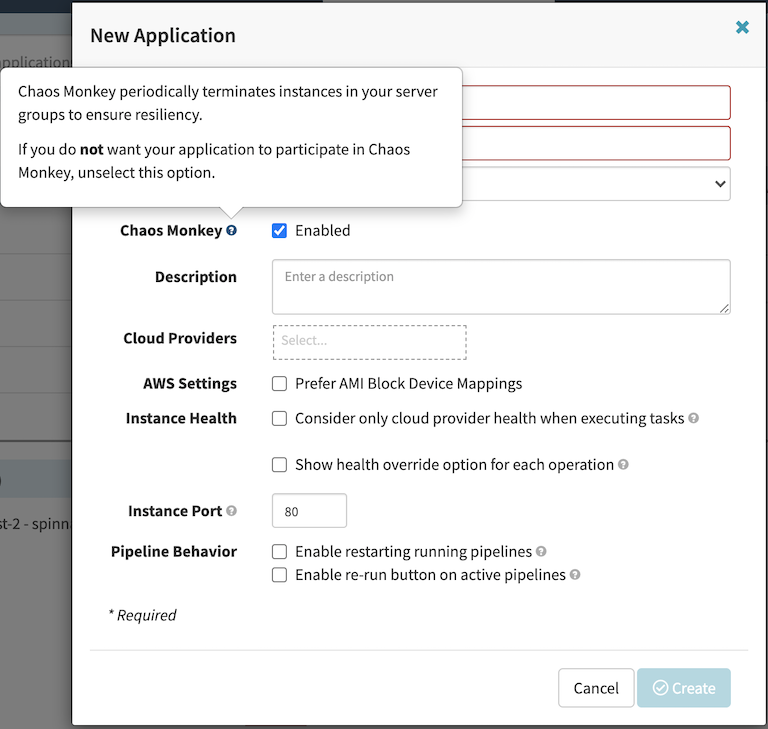
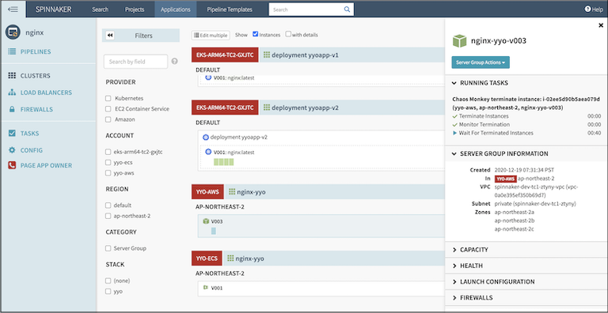

# Chaos Monkey
[Chaos Monkey](https://netflix.github.io/chaosmonkey/) is responsible for randomly terminating instances in production to ensure that engineers implement their services to be resilient to instance failures.

## Setup
This is an example to explain how to build and deploy Chaos Monkey container into spinnaker. [This](main.tf) is the example of terraform configuration file to create ECR and CodeBuild resources on your AWS account. Check out and apply it using terraform command.

### Create an ECR repository
First, user has to build an ECR repository for dependency. The `chaosmonkey-build` module instance requires the output of the repository module as a parameter.

Run terraform:
```
terraform init
terraform apply -target module.chaosmonkey-repo -var-file tc1.tfvars
```
Also you can use the `-var-file` option for customized paramters when you run the terraform plan/apply command.
```
terraform plan -var-file default.tfvars
terraform apply -var-file default.tfvars
```

### Create a CodeBuild project
Run terraform:
```
terraform init
terraform apply -var-file tc1.tfvars
```
After all, user will see the generated ECR repo and CodeBuild project for Chaos Monkey docker image build.

### Set up Database
Chaos Monkey also requires a MySQL-compatible database, version 5.6 or later. The users can utilise the MySQL database installed for spinnaker together. Launch a mysql-client container inside Kubernetes running the spinnaker to access the MySQL database. Run kubectl command:
```
$ kubectl run mysql-client --image mysql:5.7 --env MYSQL_ROOT_PASSWORD=supersecret
$ kubectl exec -it mysql-client -- bash
mysql-client-xxxxxxxxx-yyyyy:/$ mysql -h {endpoint} -P {port} -u {user} -p
mysql>
```
Create a `chaosmonkey` database and `chaosmonkey_service` user. This is an example:
```
CREATE DATABASE chaosmonkey;

GRANT
  SELECT, INSERT, UPDATE, DELETE, CREATE, DROP, REFERENCES, INDEX, ALTER, LOCK TABLES, EXECUTE, SHOW VIEW
ON 'chaosmonkey'.*
TO 'chaosmonkey_service'@'%';

SET PASSWORD FOR 'chaosmonkey_service'@'%' = PASSWORD('changeme');

flush privileges;
```
Finally, exit MySQL and clean up the workspace. This mysql-client container is a temporary resource for initial setup, so we need to remove the access point to the database.
```
$ kubectl delete po mysql-client
```

### Upload Chaos Monkey configuration
Chaos Monkey uses [TOML:Tom's Obvious, Minimal Language](https://github.com/toml-lang/toml) format for configuration. See the basic [configuration](chaosmonkey.toml). We need to modify the endpoint, password with the information configured inside the database. That way the application can access the database. We're assuming chaosmonkey runs on the same Kubernetes, so we will not update the spinnaker access point in that toml file. When we are done changing the settings, need to update the file with the configmap of the Kubernetes cluster for sharing. The application will take this configuration from the configmap and use it when running.
```
$ kubectl -n spinnaker create cm chaosmonkey --from-file chaosmonkey.toml
```
### Enabling Chaos Monkey in spinnaker
We can enable Chaos Monkey using halyard. Run `kubectl` command to enter the halyard container for configration. To update the feature configuration to enable chaos monkey, run halyard command like following:
```
$ kubectl -n spinnaker exec -it cd-spinnaker-halyard-0 -- bash
bash $ hal config features edit --chaos=true
bash $ hal deploy apply
```
If the feature was enabled successfully, when you create a new app with spinnaker, you will see a "Chaos Monkey: Enabled" checkbox in the "New Application" modal dialog. If it does not appear, you may need to deploy a more recent version of spinnaker.



### Configure Chaos Monkey pipeline
#### Build container image
Finished all previous steps, users can make a spinnaker pipeline to deliver Chaos Monkey deployment on the EKS cluster where the spinnaker is running. Move on the spinnaker and create a new `chaosmonkey` application. Open pipeline tab and select create pipeline button. Spinnaker screen will be changed to pipeline configuration mode, and the users can start editing new pipeline. Add `AWS CodeBuild` stage to connect the CI job.

#### Create the database schema
Once we have created a chaosmonkey database and have populated the configuration file with the database credentials, add the tables to the database. Create a pipeline as `init` in the `chaosmonkey` application that we've made before. And add `Deploy` stage there with below manifest. Then run the pipeline for chaos monkey database initilaization.
```
apiVersion: apps/v1
kind: Deployment
metadata:
  name: chaosmonkey
spec:
  replicas: 1
  selector:
    matchLabels:
      app: chaosmonkey
  template:
    metadata:
      labels:
        app: chaosmonkey
    spec:
      containers:
        - args:
            - migrate
          command:
            - chaosmonkey
          image: {AWS_ACCOUNT_ID}.dkr.ecr.ap-northeast-2.amazonaws.com/chaosmonkey
          name: chaosmonkey
          volumeMounts:
            - mountPath: /go/chaosmonkey.toml
              name: chaosmonkey-config
              subPath: chaosmonkey.toml
      volumes:
        - configMap:
            name: chaosmonkey
          name: chaosmonkey-config
```

#### Terminate instances
Create a pipeine `terminate` in the `chaosmonkey` application and add `Deploy` stage. In the details of `Deploy` stage configuration window, select `default` namespace where the spinnaker is running. It makes sure that chaosmonkey container runs next to the spinnaker.
Here is an example of manifest to deploy chaosmonkey container. Don't forget to replace {AWS_ACCOUNT_ID} with your own AWS account number and also modify the arguments of Chaos Monkey command to adopt it to your environment. The arguments `nginx` and `default` are examples of the spinnaker's application name and aws account name, assuming the user wants to termiate. In this example, chaosmonkey will termiate the EC2 instances managed by `default` provider in the `nginx` application in the spinnaker.
```
apiVersion: apps/v1
kind: Deployment
metadata:
  name: chaosmonkey
spec:
  replicas: 1
  selector:
    matchLabels:
      app: chaosmonkey
  template:
    metadata:
      labels:
        app: chaosmonkey
    spec:
      containers:
        - args:
            - terminate
            - nginx
            - default
          command:
            - chaosmonkey
          image: {AWS_ACCOUNT_ID}.dkr.ecr.ap-northeast-2.amazonaws.com/chaosmonkey
          name: chaosmonkey
          volumeMounts:
            - mountPath: /go/chaosmonkey.toml
              name: chaosmonkey-config
              subPath: chaosmonkey.toml
      volumes:
        - configMap:
            name: chaosmonkey
          name: chaosmonkey-config
```



## Clean up
Run terraform:
```
$ terraform destroy
```
Don't forget you have to use the `-var-file` option when you run terraform destroy command to delete the aws resources created with extra variable files.
```
$ terraform destroy -var-file default.tfvars
```
