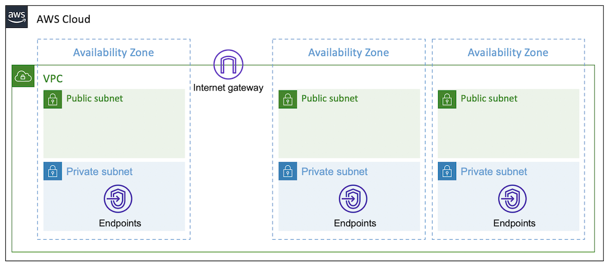
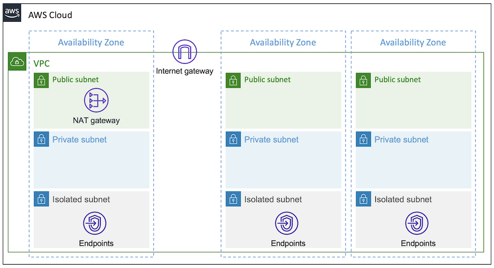
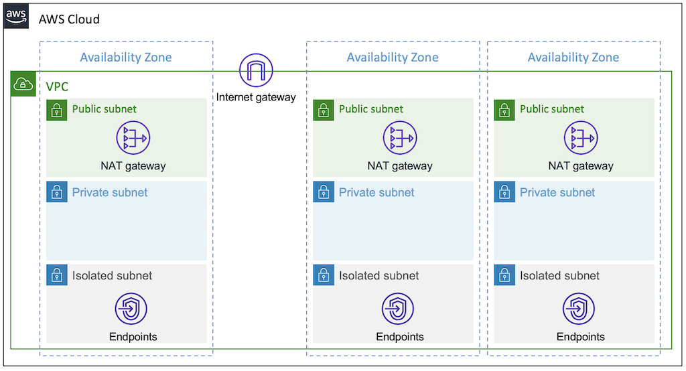

# Amazon VPC
[Amazon Virtual Private Cloud(Amazon VPC)](https://aws.amazon.com/vpc/) is a service that lets you launch AWS resources in a logically isolated virtual network that you define. You have complete control over your virtual networking environment, including selection of your own IP address range, creation of subnets, and configuration of route tables and network gateways. You can use both IPv4 and IPv6 for most resources in your virtual private cloud, helping to ensure secure and easy access to resources and applications.

## Quickstart
### Setup
```hcl
module "vpc" {
  source           = "Young-ook/spinnaker/aws//modules/spinnaker-aware-aws-vpc"
  version          = ">= 2.0"
  name             = "example"
}
```
Run terraform:
```
terraform init
terraform apply
```

### Network Architecture
#### Subnets
A VPC that is made from this module consists of different thress subnets that instances can be placed into. There is the description of three subnet types:

*Isolated* - isolated subnets do not route from or to the Internet, and as such do not require [NAT gateways](https://docs.aws.amazon.com/vpc/latest/userguide/vpc-nat-gateway.html). They can only connect to or be connected to from other instances in the same VPC.


*Private* - instances in private subnets are not directly routable from the Internet, and connect out to the Internet via a NAT gateway. Be aware that you will be charged for NAT gateways.

*Public* - public subnets connect directly to the Internet using an Internet Gateway. If you want your instances to have a public IP address and be directly reachable from the Internet, you must place them in a public subnet.

#### NAT(Network Address Translation) Gateway
The following diagram shows how to deploy a vpc with a single shared NAT gateway across the availability zones. This is a cost-effective method, but it has the weakness of causing communication problems when something goes wrong with the availability zone where the NAT gateway is located. This is good choice for development environments.


For high availability of communication between resources (instances) inside and outside your VPC, you should deploy a NAT gateway at least per Availability Zone. It is recommended to apply this configuration for production environments. By default, a NAT gateway is created in every public subnet for maximum availability.

